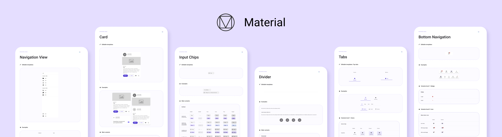

# Uno Toolkit

<p align="center">
  
</p>

[](https://gitpod.io/#https://github.com/unoplatform/uno.toolkit.ui)
[](https://uno-platform.visualstudio.com/Uno%20Platform/_build/latest?definitionId=14&branchName=unorel%2F7.1)
[](LICENSE.md)

Uno Toolkit provides a set of higher-level UI Controls designed specifically for multi-platform, responsive applications.

## Packages

Package|Stable|Preview
-|-|-
Uno.Toolkit.UI|[](https://www.nuget.org/packages/Uno.Toolkit.UI)|[](https://www.nuget.org/packages/Uno.Toolkit.UI)
Uno.Toolkit.UI.Material|[](https://www.nuget.org/packages/Uno.Toolkit.UI.Material)|[](https://www.nuget.org/packages/Uno.Toolkit.UI.Material)
Uno.Toolkit.UI.Cupertino|[](https://www.nuget.org/packages/Uno.Toolkit.UI.Cupertino)|[](https://www.nuget.org/packages/Uno.Toolkit.UI.Cupertino)
Uno.Toolkit.WinUI|[](https://www.nuget.org/packages/Uno.Toolkit.WinUI)|[](https://www.nuget.org/packages/Uno.Toolkit.WinUI)
Uno.Toolkit.WinUI.Material|[](https://www.nuget.org/packages/Uno.Toolkit.WinUI.Material)|[](https://www.nuget.org/packages/Uno.Toolkit.WinUI.Material)
Uno.Toolkit.WinUI.Cupertino|[](https://www.nuget.org/packages/Uno.Toolkit.WinUI.Cupertino)|[](https://www.nuget.org/packages/Uno.Toolkit.WinUI.Cupertino)

## Getting Started

See the complete [documentation](#documentation) for starting with this library.
For a larger example and features demo, visit the [Uno Gallery](https://github.com/unoplatform/uno.gallery) repository.

## Sample apps

PR previews and main deployments use `ToolkitSampleApp`, a wrapper that hosts Material,
Cupertino, and Simple in isolated assembly contexts. Use the picker to switch themes,
Reload to restart a theme, or Unload to return to the empty host. A browser URL can select
an initial theme with `?app=material`, `?app=cupertino`, or `?app=simple`.
The individual sample heads remain runnable on their own.

Build and run the desktop wrapper (this also builds its guests):

```bash
dotnet run --project samples/Uno.Toolkit.Samples.ThemeWrapper/ToolkitSampleApp.csproj -c Release -f net10.0-desktop -p:TargetFrameworkOverride=desktop
```

Build the WASM guests, then publish the combined site:

```bash
bash build/workflow/scripts/build-wasm-guest-heads.sh Release
dotnet publish samples/Uno.Toolkit.Samples.ThemeWrapper/ToolkitSampleApp.csproj -c Release -f net10.0-browserwasm -p:TargetFrameworkOverride=browserwasm -p:CompressionEnabled=false
```

The deployable site is under
`samples/Uno.Toolkit.Samples.ThemeWrapper/bin/Release/net10.0-browserwasm/publish/wwwroot`.
The wrapper is untrimmed because guest assemblies are loaded dynamically. Missing guest
builds fail packaging instead of producing a partial site. Guest font and image assets
are included in the wrapper because `ms-appx` paths resolve against its package root.

For the hosting smoke test, pass `-- --smoke` to the desktop `dotnet run` command or
open the published site with `?smoke`. It checks all themes, reload, failed/canceled
loads, and unload. Desktop Release also requires guest assembly contexts to be reclaimed;
WASM and Debug report reclamation diagnostically, matching the Uno Themes host.

## Documentation

All documentation for `Uno.Toolkit.UI` can be found on our [website](https://platform.uno/docs/articles/external/uno.toolkit.ui/doc/getting-started.html).

## Where can I get support?

Support is available through [GitHub Discussions](https://github.com/unoplatform/uno/discussions) or [Discord Server](https://platform.uno/discord) - where our engineering team and community will be able to help you.

## Contributing

Please read our [contributing guide](https://github.com/unoplatform/uno/blob/master/CONTRIBUTING.md) to learn about our development process and how to propose bug fixes and improvements.
Come visit us on our [Discord Server](https://platform.uno/discord) for help on how to contribute!

Contribute to Uno in your browser using [GitPod.io](https://gitpod.io), follow [our guide here](https://platform.uno/docs/articles/features/working-with-gitpod.html).

Be also mindful of our [Code of Conduct](CODE_OF_CONDUCT.md).

## Acknowledgments

- [Uno Platform](https://platform.uno)
- [Material Design 3](https://m3.material.io/)
- [Material Design](https://material.io/design)
- [Cupertino - Human Interface Guideline styling](https://developer.apple.com/design/human-interface-guidelines)
- [WinUI](https://microsoft.github.io/microsoft-ui-xaml/)

## License

This project is licensed under the Apache 2.0 license - see the [LICENSE](LICENSE) file for details.

## Contributors

Thanks go to these wonderful people (List made with [contrib.rocks](https://contrib.rocks)):

[](https://github.com/unoplatform/uno.toolkit.ui/graphs/contributors)

💖 Thank you.
