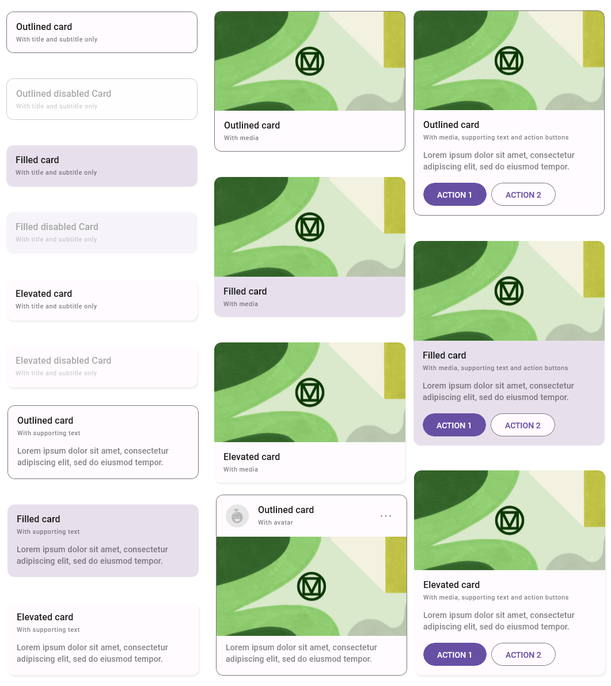
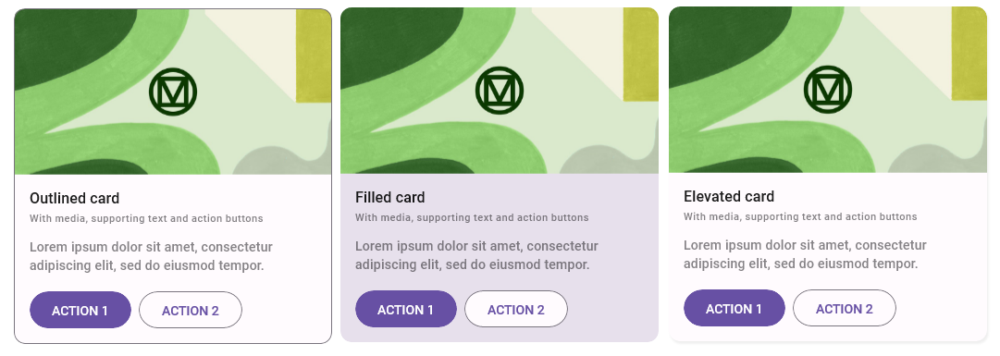

# Card & CardContentControl

> [!TIP]
> This guide covers details for `Card` and `CardContentControl` specifically. If you are just getting started with the Uno Material Toolkit Library, please see our [general getting started](../getting-started.md) page to make sure you have the correct setup in place.

## Summary

`Card` and `CardContentControl` represent controls identifiable as a single, contained unit used to visually group related child content and actions that relate information about a subject.
A card's layout and dimensions depend on its contents.

## Remarks

Currently, there are three [Material](https://m3.material.io/components/cards/) styles for `Card` and `CardContentControl` that you can use.
Depending on the amount of user attention you want to draw to the content you can use:

- `ElevatedCardStyle` or `ElevatedCardContentControlStyle` to add a subtle z-axis elevation.
- `FilledCardStyle` or `FilledCardContentControlStyle` to display a simple background color without any elevation or border for the card.
- `OutlinedCardStyle` or `OutlinedCardContentControlStyle` to display a simple solid stroke along the border of the card.

## Card

The `Card` control is based on `Control` and allows you to customize the control's content through [additional properties](#properties) to fit your needs.

### C\#

```csharp
public partial class Card : Control
```

### XAML

```xml
xmlns:utu="using:Uno.Toolkit.UI"
...

<utu:Card .../>
```

### Inheritance

`Object` &#8594; `DependencyObject` &#8594; `UIElement` &#8594; `FrameworkElement` &#8594; `Control` &#8594; `Card`

### Constructors

| Constructor | Description                                     |
|-------------|-------------------------------------------------|
| `Card()`    | Initializes a new instance of the `Card` class. |

### Properties

The `Card` control comes with all the built-in properties of a `Control`, and also a few additional properties listed below that let you tailor the content to be displayed:

| Property                    | Type           | Description                                                                                   |
|-----------------------------|----------------|-----------------------------------------------------------------------------------------------|
| `HeaderContent`             | `object`       | Gets or sets the content for the control's header.                                            |
| `HeaderContentTemplate`     | `DataTemplate` | Gets or sets the data template used to display the content of the control's header.           |
| `SubHeaderContent`          | `object`       | Gets or sets the content for the control's subheader.                                         |
| `SubHeaderContentTemplate`  | `DataTemplate` | Gets or sets the data template used to display the content of the control's subheader.        |
| `AvatarContent`             | `object`       | Gets or sets the content for the control's avatar.                                            |
| `AvatarContentTemplate`     | `DataTemplate` | Gets or sets the data template used to display the content of the control's avatar.           |
| `MediaContent`              | `object`       | Gets or sets the content for the control's media area.                                        |
| `MediaContentTemplate`      | `DataTemplate` | Gets or sets the data template used to display the content of the control's media area.       |
| `SupportingContent`         | `object`       | Gets or sets the content for the control's supporting area.                                   |
| `SupportingContentTemplate` | `DataTemplate` | Gets or sets the data template used to display the content of the control's supporting area.  |
| `IconsContent`              | `object`       | Gets or sets the content for the control's icons.                                             |
| `IconsContentTemplate`      | `DataTemplate` | Gets or sets the data template used to display the content of the control's icons.            |
| `Elevation`                 | `double`       | Gets or sets the elevation of the control.                                                    |
| `ShadowColor`               | `Color`        | Gets or sets the color to use for the shadow of the control.                                  |
| `IsClickable`               | `bool`         | Gets or sets a value indicating whether the control will respond to pointer and focus events. |

> [!TIP]
> Consider using [CardContentControl](#cardcontentcontrol) if you need full control over the content layout.

### Usage

```xml
xmlns:utu="using:Uno.Toolkit.UI"
...

<!-- ElevatedCardStyle -->
<utu:Card HeaderContent="Elevated card"
          SubHeaderContent="With title and subtitle"
          Style="{StaticResource ElevatedCardStyle}" />

<!-- FilledCardStyle -->
<utu:Card HeaderContent="Filled card"
          SubHeaderContent="With title and subtitle"
          Style="{StaticResource FilledCardStyle}" />

<!-- OutlinedCardStyle -->
<utu:Card HeaderContent="Outlined card"
          SubHeaderContent="With title and subtitle"
          Style="{StaticResource OutlinedCardStyle}" />
```

### Examples



## Lightweight Styling

| Key                                            | Type              | Value                           |
|------------------------------------------------|-------------------|---------------------------------|
| `ContentTemplateForeground`                    | `SolidColorBrush` | `OnSurfaceMediumBrush`          |
| `ContentTemplateBorderBrush`                   | `SolidColorBrush` | `OnSurfaceMediumBrush`          |
| `FilledCardBackground`                         | `SolidColorBrush` | `SurfaceBrush`                  |
| `FilledCardBorderBrush`                        | `SolidColorBrush` | `SystemControlTransparentBrush` |
| `FilledCardBorderBrushPointerOver`             | `SolidColorBrush` | `OnSurfaceHoverBrush`           |
| `FilledCardBorderBrushFocused`                 | `SolidColorBrush` | `OnSurfaceFocusedBrush`         |
| `AvatarFilledCardBackground`                   | `SolidColorBrush` | `SurfaceBrush`                  |
| `AvatarFilledCardBorderBrush`                  | `SolidColorBrush` | `SystemControlTransparentBrush` |
| `AvatarFilledCardBorderBrushPointerOver`       | `SolidColorBrush` | `OnSurfaceHoverBrush`           |
| `AvatarFilledCardBorderBrushFocused`           | `SolidColorBrush` | `OnSurfaceFocusedBrush`         |
| `SmallMediaFilledCardBackground`               | `SolidColorBrush` | `SurfaceBrush`                  |
| `SmallMediaFilledCardBorderBrush`              | `SolidColorBrush` | `SystemControlTransparentBrush` |
| `SmallMediaFilledCardBorderBrushPointerOver`   | `SolidColorBrush` | `OnSurfaceHoverBrush`           |
| `SmallMediaFilledCardBorderBrushFocused`       | `SolidColorBrush` | `OnSurfaceFocusedBrush`         |
| `OutlinedCardBackground`                       | `SolidColorBrush` | `SurfaceBrush`                  |
| `OutlinedCardBorderBrush`                      | `SolidColorBrush` | `OutlineBrush`                  |
| `AvatarOutlinedCardBackground`                 | `SolidColorBrush` | `SurfaceBrush`                  |
| `AvatarOutlinedCardBorderBrush`                | `SolidColorBrush` | `OutlineBrush`                  |
| `SmallMediaOutlinedCardBackground`             | `SolidColorBrush` | `SurfaceBrush`                  |
| `SmallMediaOutlinedCardBorderBrush`            | `SolidColorBrush` | `OutlineBrush`                  |
| `ElevatedCardBackground`                       | `SolidColorBrush` | `SurfaceBrush`                  |
| `ElevatedCardBorderBrush`                      | `SolidColorBrush` | `SystemControlTransparentBrush` |
| `ElevatedCardBorderBrushPointerOver`           | `SolidColorBrush` | `OnSurfaceHoverBrush`           |
| `ElevatedCardBorderBrushFocused`               | `SolidColorBrush` | `OnSurfaceFocusedBrush`         |
| `AvatarElevatedCardBackground`                 | `SolidColorBrush` | `SurfaceBrush`                  |
| `AvatarElevatedCardBorderBrush`                | `SolidColorBrush` | `SystemControlTransparentBrush` |
| `AvatarElevatedCardBorderBrushPointerOver`     | `SolidColorBrush` | `OnSurfaceHoverBrush`           |
| `AvatarElevatedCardBorderBrushFocused`         | `SolidColorBrush` | `OnSurfaceFocusedBrush`         |
| `SmallMediaElevatedCardBackground`             | `SolidColorBrush` | `SurfaceBrush`                  |
| `SmallMediaElevatedCardBorderBrush`            | `SolidColorBrush` | `SystemControlTransparentBrush` |
| `SmallMediaElevatedCardBorderBrushPointerOver` | `SolidColorBrush` | `OnSurfaceHoverBrush`           |
| `SmallMediaElevatedCardBorderBrushFocused`     | `SolidColorBrush` | `OnSurfaceFocusedBrush`         |

## CardContentControl

The `CardContentControl` is based on `ContentControl` and allows you to customize the entire content through `DataTemplate` to fit your needs.

### C\#

```csharp
public partial class CardContentControl : ContentControl
```

### XAML

```xml
xmlns:utu="using:Uno.Toolkit.UI"
...

<utu:CardContentControl .../>
-or-
<utu:CardContentControl>
    <utu:CardContentControl.ContentTemplate>
        <DataTemplate>
            content
        </DataTemplate>
    </utu:CardContentControl.ContentTemplate>
</utu:CardContentControl>
```

### Inheritance

`Object` &#8594; `DependencyObject` &#8594; `UIElement` &#8594; `FrameworkElement` &#8594; `Control` &#8594; `ContentControl` &#8594; `CardContentControl`

### Constructors

| Constructor            | Description                                                   |
|------------------------|---------------------------------------------------------------|
| `CardContentControl()` | Initializes a new instance of the `CardContentControl` class. |

### Properties

The `Card` control comes with all the built-in properties of a `ContentControl`, and also a few additional properties listed below:

| Property      | Type     | Description                                                                                   |
|---------------|----------|-----------------------------------------------------------------------------------------------|
| `Elevation`   | `double` | Gets or sets the elevation of the control.                                                    |
| `ShadowColor` | `Color`  | Gets or sets the color to use for the shadow of the control.                                  |
| `IsClickable` | `bool`   | Gets or sets a value indicating whether the control will respond to pointer and focus events. |

### Usage

```xml
xmlns:utu="using:Uno.Toolkit.UI"
...

<!-- ElevatedCardContentControlStyle -->
<utu:CardContentControl Style="{StaticResource ElevatedCardContentControlStyle}">
    <utu:CardContentControl.ContentTemplate>
        <DataTemplate>
            <Grid>
                <TextBlock Text="Elevated card" MaxLines="1" Style="{StaticResource HeadlineMedium}" />
            </Grid>
        </DataTemplate>
    </utu:CardContentControl.ContentTemplate>
</utu:CardContentControl>

<!-- FilledCardContentControlStyle -->
<utu:CardContentControl Style="{StaticResource FilledCardContentControlStyle}">
    <utu:CardContentControl.ContentTemplate>
        <DataTemplate>
            <Grid>
                <TextBlock Text="Filled card" MaxLines="1" Style="{StaticResource HeadlineMedium}" />
            </Grid>
        </DataTemplate>
    </utu:CardContentControl.ContentTemplate>
</utu:CardContentControl>

<!-- OutlinedCardContentControlStyle -->
<utu:CardContentControl Style="{StaticResource OutlinedCardContentControlStyle}">
    <utu:CardContentControl.ContentTemplate>
        <DataTemplate>
            <Grid>
                <TextBlock Text="Outlined card" MaxLines="1" Style="{StaticResource HeadlineMedium}" />
            </Grid>
        </DataTemplate>
    </utu:CardContentControl.ContentTemplate>
</utu:CardContentControl>
```

### Examples



## Lightweight Styling

| Key                                         | Type              | Value                           |
|---------------------------------------------|-------------------|---------------------------------|
| `FilledCardContentBackground`               | `SolidColorBrush` | `SurfaceBrush`                  |
| `FilledCardContentBorderBrush`              | `SolidColorBrush` | `SystemControlTransparentBrush` |
| `FilledCardContentBorderBrushPointerOver`   | `SolidColorBrush` | `OnSurfaceHoverBrush`           |
| `FilledCardContentBorderBrushFocused`       | `SolidColorBrush` | `OnSurfaceFocusedBrush`         |
| `FilledCardContentBorderBrushPressed`       | `SolidColorBrush` | `OnSurfacePressedBrush`         |
| `OutlinedCardContentBackground`             | `SolidColorBrush` | `SurfaceBrush`                  |
| `OutlinedCardContentBorderBrush`            | `SolidColorBrush` | `OutlineBrush`                  |
| `ElevatedCardContentBackground`             | `SolidColorBrush` | `SurfaceBrush`                  |
| `ElevatedCardContentBorderBrush`            | `SolidColorBrush` | `SystemControlTransparentBrush` |
| `ElevatedCardContentBorderBrushPointerOver` | `SolidColorBrush` | `OnSurfaceHoverBrush`           |
| `ElevatedCardContentBorderBrushFocused`     | `SolidColorBrush` | `OnSurfaceFocusedBrush`         |
| `ElevatedCardContentBorderBrushPressed`     | `SolidColorBrush` | `OnSurfacePressedBrush`         |
