# NavigationBar

> [!TIP]
> This guide covers details for `NavigationBar` specifically. If you are just getting started with the Uno Material Toolkit Library, please see our [general getting started](../getting-started.md) page to make sure you have the correct setup in place.

## Summary

The `NavigationBar` represents a specialized app bar that provides the layout for `AppBarButton` and navigation logic.

For a quick introduction to `NavigationBar`, you can check out our introductory video below:

> [!Video https://www.youtube-nocookie.com/embed/4-Q0hy2BnMI]

This document highlights some of the differences you might encounter when working with the native mode of `NavigationBar` on either **iOS** or **Android**.

### C\#

```csharp
public partial class NavigationBar : ContentControl
```

### XAML

```xml
xmlns:utu="using:Uno.Toolkit.UI"
...

<utu:NavigationBar .../>
```

### Inheritance

`Object` &#8594; `DependencyObject` &#8594; `UIElement` &#8594; `FrameworkElement` &#8594; `Control` &#8594; `ContentControl` &#8594; `NavigationBar`

### Constructors

| Constructor       | Description                                              |
|-------------------|----------------------------------------------------------|
| `NavigationBar()` | Initializes a new instance of the `NavigationBar` class. |

## Modes

The `NavigationBar` supports 2 different modes:

| Mode    | Style                        |
|---------|------------------------------|
| Windows | `XamlDefaultNavigationBar`   |
| Native  | `NativeDefaultNavigationBar` |

### Windows

Under the hood, this mode uses a custom-styled `CommandBar`. It is templatable and supports a template that's almost identical to **UWP**'s default `CommandBar`, except for the addition of a leading `AppBarButton` named `MainCommand`.


#### Usage Example

```xml
<Style TargetType="utu:NavigationBar" BasedOn="{StaticResource XamlDefaultNavigationBar}" />
```

### Native

This mode is the default for Android and iOS. It uses platform-specific controls to ensure a more native user experience.

#### Android


#### iOS

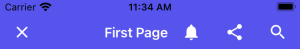

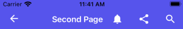

| Platform | Native control    | Benefits                                              |
|----------|-------------------|-------------------------------------------------------|
| Android  | `Toolbar`         | Native pressed states (ripple), native overflow menu. |
| iOS      | `UINavigationBar` | Transitions when navigating between pages.            |

The rest of this document will exclusively cover the native mode.

#### Usage Example

```xml
<Style TargetType="NavigationBar" BasedOn="{StaticResource NativeDefaultNavigationBar}" />
```

Remarks:

In this mode, the `NavigationBar` can't be fully customized like other templatable controls would. Additionally, you can't customize the visual states of either the `NavigationBar` or its `AppBarButtons`.

#### Padding

By default on iOS and Android, the `VisibleBoundsPadding.PaddingMask` on `NavigationBar` is set to `Top` to properly support the screen notch or punch-holes.

## Properties

| Property                     | Windows | iOS | Android | Comments                                                                                                              |
|------------------------------|:-------:|:---:|:-------:|---------------------------------------------------------------------------------------------------------------------- |
| `Background`                 | x       | x   | x       |                                                                                                                       |
| `Content`                    | x       | x   | x       |                                                                                                                       |
| `Foreground`                 | x       | x   | x       |                                                                                                                       |
| `Height`                     | x       | -   | -       | **iOS** and **Android**: Fixed and can't be changed.                                                                  |
| `HorizontalAlignment`        | x       | -   | x       | **iOS**: Always use `HorizontalAlignment.Stretch`.                                                                    |
| `Opacity`                    | x       | x   | x       |                                                                                                                       |
| `Padding`                    | x       | x   | x       | **iOS** and **Android**: Please refer to the `Padding` section.                                                       |
| `MainCommand`                | x       | x   | x       |                                                                                                                       |
| `PrimaryCommands`            | x       | x   | x       |                                                                                                                       |
| `SecondaryCommands`          | x       | -   | x       | **iOS**: Not supported.                                                                                               |
| `VerticalAlignment`          | x       | -   | x       | **iOS**: Always use `VerticalAlignment.Top`.                                                                          |
| `Visibility`                 | x       | x   | x       |                                                                                                                       |
| `Width`                      | x       | -   | x       | **iOS**: Always use `double.NaN`.                                                                                     |
| `HorizontalContentAlignment` | x       | -   | x       | **Android**: Stretch and Left are supported. **Windows**: Set `IsDynamicOverflowEnabled="False"` for proper behavior. |
| `VerticalContentAlignment`   | x       | -   | -       | Only supported on Windows. **Android**: Alignment needs to be done through the content itself.                        |

*If it's not listed, assume it's not supported.*

### Background

Gets or sets a `Brush` that describes the background of a control.


Remarks:

* Only supports `SolidColorBrush`.
* Changing the opacity through `SolidColorBrush.Opacity` is supported.

### Content

Gets or sets the content of a `ContentControl`.

Remarks:

The `Content` is processed differently whether it is of type `string` or `FrameworkElement`.

When `Content` is a `string`, it's displayed using the platform's default font family, font size, font style, and text alignment. Only the foreground color can be changed, using `Foreground`.


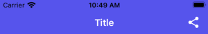

```xml
<utu:NavigationBar Content="Title">
  <utu:NavigationBar.PrimaryCommands>
    <AppBarButton Label="Share">
      <AppBarButton.Icon>
        <BitmapIcon UriSource="ms-appx:///Assets/Share.png" />
      </AppBarButton.Icon>
    </AppBarButton>
  </utu:NavigationBar.PrimaryCommands>
</utu:NavigationBar>
```

| Platform | FontFamily    | FontSize | HorizontalAlignment |
|----------|---------------|----------|---------------------|
| iOS      | San Francisco | 17       | Center              |
| Android  | Roboto        | 20       | Left                |

| Platform | Available height |
|----------|:----------------:|
| iOS      | 30px             |
| Android  | 48px             |

When `Content` is a `FrameworkElement`, it's displayed within the available area:


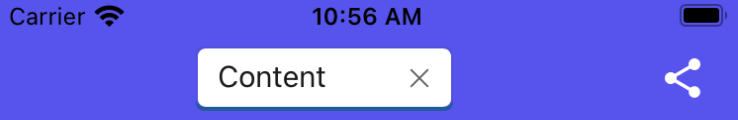

```xml
<utu:NavigationBar>
  <utu:NavigationBar.Content>
    <TextBox />
  </utu:NavigationBar.Content>
  <utu:NavigationBar.PrimaryCommands>
    <AppBarButton Label="Share">
      <AppBarButton.Icon>
        <BitmapIcon UriSource="ms-appx:///Assets/Share.png" />
      </AppBarButton.Icon>
    </AppBarButton>
  </utu:NavigationBar.PrimaryCommands>
</utu:NavigationBar>
```

Please note that:

* `HorizontalContentAlignment` and `VerticalContentAlignment` are ignored.
* On **iOS**, the Content is automatically centered horizontally unless `HorizontalAlignment.Stretch` is used.

### Foreground

Gets or sets a `Brush` that describes the foreground color.

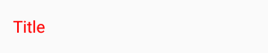

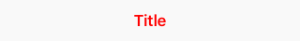

```xml
<utu:NavigationBar Content="Title"
                   Foreground="Red">
                   ...
</utu:NavigationBar>
```

Remarks:

* This is typically used to change the text color of the `Content`.
* Only supports `SolidColorBrush`.
* Setting this property will not affect the tint color of the `PrimaryCommands` or `SecondaryCommands`. If you need to change the `AppBarButton` color, you should set the `Foreground` property on each `AppBarButton`s individually.

### PrimaryCommands

Gets the collection of primary command elements for the `NavigationBar`.

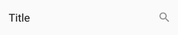

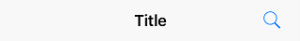

```xml
<utu:NavigationBar Content="Title">
  <utu:NavigationBar.PrimaryCommands>
    <AppBarButton Label="Search">
      <AppBarButton.Icon>
        <BitmapIcon UriSource="ms-appx:///Assets/Search.png" />
     </AppBarButton.Icon>
   </AppBarButton>
  </utu:NavigationBar.PrimaryCommands>
</utu:NavigationBar>
```

Remarks:

* Only supports `AppBarButton`.
* `AppBarToggleButton` and `AppBarSeparator` are not supported.
* Refer to the `AppBarButton` section for details.

### SecondaryCommands

Gets the collection of secondary command elements for the `NavigationBar`.

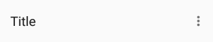

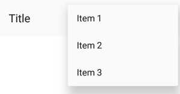

```xml
<utu:NavigationBar Content="Title">
  <utu:NavigationBar.SecondaryCommands>
    <AppBarButton Label="Item 1" />
    <AppBarButton Label="Item 2" />
    <AppBarButton Label="Item 3" />
  </utu:NavigationBar.SecondaryCommands>
</utu:NavigationBar>
```

Remarks:

* Not supported on **iOS**.

### Height

Gets or sets the suggested height of a `FrameworkElement`.

Remarks:

The height is fixed and cannot be changed.

| Platform | Form factor | Portrait | Landscape |
|----------|-------------|:--------:|:---------:|
| iOS      | Phone       | 44pt     | 44pt      |
| iOS      | Tablet      | 44pt     | 44pt      |
| Android  | Phone       | 48dp     | 56dp      |
| Android  | Tablet      | 64dp     | 64dp      |

[Source (Android)](https://material.io/guidelines/layout/structure.html#structure-app-bar)

### MainCommandMode

The `NavigationBar` has a property named `MainCommandMode` that can be set to either:

1. `MainCommandMode.Back` (default)
1. `MainCommandMode.Action`

`MainCommandMode` should be set to `Action` when the `MainCommand` is being used for anything other than backward navigation, such as displaying a burger menu or displaying a prompt to the user before the navigation occurs.

### MainCommand

Gets or sets the `AppBarButton` that the `NavigationBar` will use for displaying a back arrow or custom icon.

Remarks:

Unlike the `PrimaryCommands` or `SecondaryCommands`, which appear to the right of the `NavigationBar`, the `MainCommand` is a special `AppBarButton` that appears to the left of the `NavigationBar`.

Whenever the `NavigationBar` is part of a `Page` whose `Frame` has a non-empty back stack, the back button will be displayed as long as the `NavigationBar` has its `MainCommandMode` set to `Back`.

If no `MainCommand` is provided in the XAML, the `NavigationBar` will render the native back button icons/text when appropriate.

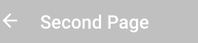

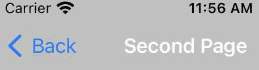

`MainCommand` is typically used for customizing the back button, displaying a different icon, and/or invoking some type of custom action other than back navigation when clicked.

> [!NOTE]
> The default back button icon can be customized for non-mobile platforms by overriding the `NavigationBarBackIconData` resource. On `Android` and `iOS`, the native default back button icon is used. On Windows and other non-mobile platforms, you can provide a custom back button icon by defining the `NavigationBarBackIconData` resource in your resource dictionary:
>
>```xml
><Application.Resources>
>    <x:String x:Key="NavigationBarBackIconData">YOUR_CUSTOM_PATH_DATA</x:String>
></Application.Resources> 
>```

### MainCommand Properties

#### Label

Gets or sets the back button title for the `MainCommand`.

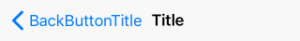

```xml
<utu:NavigationBar Content="Title">
  <utu:NavigationBar.MainCommand>
    <AppBarButton Label="BackButtonTitle" />
  </utu:NavigationBar.MainCommand>
</utu:NavigationBar>
```

Remarks:

Only supported on **iOS**.

On **iOS**, the back button displays the title of the previous page (which we usually set as a `string` on the `NavigationBar.Content` property). When the title of the previous page is too long (over 140px wide on iPhone 5) or isn't set (for example, if we set `FrameworkElement` instead of `string` on `NavigationBar.Content`), "Back" will be displayed instead.

If navigating from ViewController A to ViewController B, B's back button text is determined either by A's `NavigationBar.MainCommand.Label` or by A's `NavigationBar.Content` as described previously.
To explicitly provide a value to be used by the back button of the next page, set the next page's `MainCommand.Label`.

To remove the back button title from all pages (and only leave the back arrow), set `Label` to `""` in the default `MainCommand` style.

#### Foreground

Gets or sets the back button foreground for the `MainCommand`.

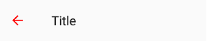

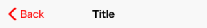

```xml
<utu:NavigationBar Content="Title">
  <utu:NavigationBar.MainCommand>
    <AppBarButton Foreground="Red" />
  </utu:NavigationBar.MainCommand>
</utu:NavigationBar>
```

OR

```xml
<Style x:Key="MyCustomAppBarButtonStyle" TargetType="AppBarButton">
  <Setter Property="Foreground"
            Value="Red" />
</Style>

  <Style TargetType="utu:NavigationBar">
      <Setter Property="MainCommandStyle"
              Value="{StaticResource MyCustomAppBarButtonStyle}" />
  </Style>
```

Remarks:

Only supports `SolidColorBrush`.

#### Icon

Gets or sets the back button icon for the `MainCommand`.

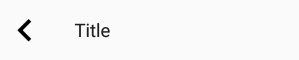

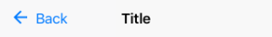

```xml
<utu:NavigationBar Content="Title">
  <utu:NavigationBar.MainCommand>
    <AppBarButton>
      <AppBarButton.Icon>
        <BitmapIcon UriSource="ms-appx:///Assets/Close.png" />
      </AppBarButton.Icon>
    </AppBarButton>
  </utu:NavigationBar.MainCommand>
</utu:NavigationBar>
```

Remarks:

Only supports `BitmapImage` on iOS/Android

## Lightweight Styling

| Key                                                                    | Type              | Value                                   |
|------------------------------------------------------------------------|-------------------|-----------------------------------------|
| `NavigationBarCommandBarEllipsisIconForegroundDisabled`                | `SolidColorBrush` | TextFillColorDisabledBrush              |
| `NavigationBarCommandBarBackgroundCompactOpenUp`                       | `SolidColorBrush` | SurfaceBrush                            |
| `NavigationBarCommandBarBackgroundCompactOpenDown`                     | `SolidColorBrush` | SurfaceBrush                            |
| `NavigationBarMainCommandForeground`                                   | `SolidColorBrush` | OnSurfaceBrush                          |
| `NavigationBarForeground`                                              | `SolidColorBrush` | OnSurfaceBrush                          |
| `NavigationBarBackground`                                              | `SolidColorBrush` | SurfaceBrush                            |
| `NavigationBarPadding`                                                 | `Thickness`       | 4,0,0,0                                 |
| `NavigationBarFontFamily`                                              | `FontFamily`      | TitleLargeFontFamily                    |
| `NavigationBarFontWeight`                                              | `String`          | TitleLargeFontWeight                    |
| `NavigationBarFontSize`                                                | `Double`          | TitleLargeFontSize                      |
| `NavigationBarBackIconData`                                            | `String`          | NavigationBarBackIconData               |
| `MaterialModalNavigationBarMainCommandForeground`                      | `SolidColorBrush` | OnSurfaceBrush                          |
| `MaterialModalNavigationBarForeground`                                 | `SolidColorBrush` | OnSurfaceBrush                          |
| `MaterialModalNavigationBarBackground`                                 | `SolidColorBrush` | SurfaceBrush                            |
| `MaterialPrimaryNavigationBarCommandBarEllipsisIconForegroundDisabled` | `SolidColorBrush` | TextFillColorDisabledBrush              |
| `MaterialPrimaryNavigationBarCommandBarBackgroundCompactOpenUp`        | `SolidColorBrush` | PrimaryBrush                            |
| `MaterialPrimaryNavigationBarCommandBarBackgroundCompactOpenDown`      | `SolidColorBrush` | PrimaryBrush                            |
| `MaterialPrimaryNavigationBarMainCommandForeground`                    | `SolidColorBrush` | OnPrimaryBrush                          |
| `MaterialPrimaryNavigationBarForeground`                               | `SolidColorBrush` | OnPrimaryBrush                          |
| `MaterialPrimaryNavigationBarBackground`                               | `SolidColorBrush` | PrimaryBrush                            |
| `MaterialPrimaryAppBarButtonForeground`                                | `SolidColorBrush` | OnPrimaryBrush                          |
| `MaterialPrimaryModalNavigationBarMainCommandForeground`               | `SolidColorBrush` | OnPrimaryBrush                          |
| `MaterialPrimaryModalNavigationBarForeground`                          | `SolidColorBrush` | OnPrimaryBrush                          |
| `MaterialPrimaryModalNavigationBarBackground`                          | `SolidColorBrush` | PrimaryBrush                            |
| `NavigationBarOverflowAppBarButtonForeground`                          | `SolidColorBrush` | OnPrimaryBrush                          |
| `NavigationBarOverflowAppBarButtonBackground`                          | `SolidColorBrush` | SolidColorBrush { Color = Transparent } |
| `NavigationBarEllipsisButtonForeground`                                | `SolidColorBrush` | OnSurfaceBrush                          |
| `NavigationBarEllipsisButtonBackground`                                | `SolidColorBrush` | SolidColorBrush { Color = Transparent } |
| `MaterialNavigationBarElevation`                                       | `Double`          | 4                                       |
| `MaterialXamlNavigationBarHeight`                                      | `Double`          | 64                                      |
| `MaterialNavigationBarHeight`                                          | `Double`          | 48                                      |
| `MaterialNavigationBarContentMargin`                                   | `Thickness`       | 16,0,0,0                                |
| `MaterialAppBarEllipsisButtonInnerBorderMargin`                        | `Thickness`       | 2,6,6,6                                 |
| `NavigationBarMaterialEllipsisButtonFontFamily`                        | `FontFamily`      | MaterialRegularFontFamily               |
| `NavigationBarMaterialEllipsisButtonFontWeight`                        | `FontWeight`      | SemiBold                                |
| `NavigationBarMaterialEllipsisButtonFontSize`                          | `Double`          | ControlContentThemeFontSize             |
| `NavigationBarMaterialEllipsisButtonWidth`                             | `Double`          | AppBarExpandButtonThemeWidth            |
| `NavBarAppBarButtonContentHeight`                                      | `Double`          | 24                                      |
| `NavBarMainCommandAppBarButtonContentHeight`                           | `Double`          | 16                                      |
| `NavBarAppBarThemeCompactHeight`                                       | `Double`          | 56                                      |
| `NavBarAppBarButtonPadding`                                            | `Thickness`       | 12,16                                   |
| `NavBarAppBarButtonHasFlyoutChevronVisibility`                         | `Visibility`      | Collapsed                               |

## Navigation

The `NavigationBar` automatically hooks itself up to the [`SystemNavigationManager.BackRequested` event](https://learn.microsoft.com/uwp/api/windows.ui.core.systemnavigationmanager.backrequested) and will attempt to navigate back by calling `Frame.GoBack()` as long as all of the following conditions are met:

* `MainCommandMode` for the `NavigationBar` is set to `MainCommandMode.Back`
* The `Frame` that contains the `NavigationBar` is currently visible
* The current `Page` of the `Frame` is equal to the parent `Page` of the `NavigationBar`

NOTE: `SystemNavigationManager` is not supported for WinAppSDK

The `NavigationBar` is also aware of its parent `Page` possibly being hosted in a `Popup` (for things like modal pages) and will close the `Popup` when attempting to navigate backward within the `Popup` while `Frame.BackStack` is empty.

## Placement

On **iOS**, the same `UINavigationBar` instance is shared throughout all pages. When navigating between two pages, you can see that the `UINavigationBar` doesn't move, and only its content and the pages have a transition. To get the same effect for Uno's `NavigationBar`, the `NavigationBar` that you define inside your `Page` is never actually rendered there, and only serves as a placeholder from which to read the information we need to pass to the shared native `UINavigationBar` instance.

To ensure everything works properly, you must follow a few rules:

* The `NavigationBar` must stretch horizontally and be aligned with the top of your `Page`
* The `NavigationBar` can't move (i.e., don't put it inside a `ScrollViewer`)
* The `NavigationBar` must be accessible as soon as the `Page` is being navigated to (i.e., don't put it inside a `DataTemplate`)
* There can only be one `NavigationBar` per `Page`

## Extensibility

The `NavigationBar` is automatically managed by the `Frame` control, however, you can still use the "native" mode of the `NavigationBar` with your own navigation mechanism.

On **iOS** a `NavigationBarHelper` is available for this purpose, you only have to invoke each of the provided methods in your own `UIViewController` implementation.

## AppBarButton

The `AppBarButton` in **Uno** is designed to be used the same way you would use the `AppBarButton` on **UWP**. In most cases, you should refer to the [official `AppBarButton` documentation](https://learn.microsoft.com/uwp/api/windows.ui.xaml.controls.appbarbutton).

When `AppBarButton` is used within a native `NavigationBar`, its control template is completely ignored and can't be customized.

### Events

| Event     | Windows | iOS | Android | Comments |
|-----------|:-------:|:---:|:-------:|----------|
| `Clicked` | x       | x   | x       |          |

### Properties

| Property       | Windows | iOS | Android | Comments                                  |
|----------------|---------|-----|---------|-------------------------------------------|
| `Command`      | x       | x   | x       |                                           |
| `Content`      | x       | x*  | x*      | Supports `string` and `FrameworkElement`  |
| `Foreground`   | x       | x   | x*      | **Android**: See details below            |
| `Icon`         | x       | x*  | x*      | See details below                         |
| `IsEnabled`    | x       | x   | x*      | **Android**: Not supported with `Content` |
| `Label`        | x       | x*  | x*      | See details below                         |
| `Opacity`      | x       | x   | x       |                                           |
| `Visibility`   | x       | x   | x       |                                           |
| `IsInOverflow` | x       | -   | x       | **Android**: See details below            |

*If it's not listed, assume it's not supported.*

### Foreground

Gets or sets the brush used for the foreground color of this control.

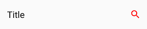

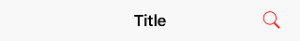

Remarks:

* This changes the color of the `Content` (text) or `Icon`.
* Only supports `SolidColorBrush`.
* On **Android**, this only affects the color of `Icon`, not `Content` (text).
* On **iOS**, the default value is blue.

### Content

Gets or sets the content of the control.

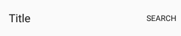

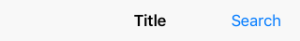

Remarks:

* When given a `string`, its text will be displayed instead of the icon.
* When given a `FrameworkElement`:
  * it will be displayed instead of the `Icon` if the latter is not set
  * the native pressed state and tooltip (Android only) won't work
* Make sure to set `Icon` to null, as it takes priority over `Content`.

### Icon

Gets or sets the graphic content of the `AppBarButton`

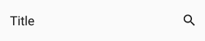


Remarks:

* On **Android**, the `MainCommand` Icon only supports `BitmapIcon`s. `PrimaryCommands` and `SecondaryCommands` support any `IconElement` type.

### Recommended icon sizes (by scale)

| Platform | 100%  | 150%  | 200%  | 300%  | 400%    |
|----------|:-----:|:-----:|:-----:|:-----:|:-------:|
| iOS      | 25x25 | -     | 50x50 | 75x75 | -       |
| Android  | 24x24 | 36x36 | 48x48 | 72x72 | 96x96   |
| Windows  | 32x32 | 48x48 | 64x64 | 96x96 | 128x128 |

### Label

Gets or sets the text description of the control.

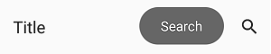


Remarks:

The `Label` will not be displayed below the `Icon` when being placed in a native `NavigationBar`. The exception on **iOS** is the case of the `Label` being set on `MainCommand` to override the default "Back" string next to the back arrow

`Label` is only displayed on **Android** when the `AppBarButton` is displayed from the overflow (when part of `SecondaryCommands` or if `IsInOverflow` is `True`)

It is highly recommended to set and localize `Label` on all `AppBarButton`s, if only for accessibility.

### IsInOverflow

**Android only**

Gets or sets a value indicating whether the `AppBarButton` is in the overflow menu.


Remarks:

* When set to `True`, the `AppBarButton` will be placed in the native overflow menu of the Android `Toolbar`
* When set to `False`, the native Android `NavigationBar` will attempt to display the `AppBarButton` directly on the `Toolbar` if there is room available

## FAQ: NavigationBar

### How can I remove the back button title from all pages on iOS?

  ```xml
  xmlns:utu="using:Uno.Toolkit.UI"
  ...
  <Style x:Key="MyCustomAppBarButtonStyle"
         BasedOn="{StaticResource AppBarButtonStyle}"
         TargetType="AppBarButton">
   <Setter Property="Label"
              Value="" />
  </Style>

  <Style BasedOn="{StaticResource NavigationBarStyle}"
         TargetType="utu:NavigationBar">
      <Setter Property="MainCommandStyle"
              Value="{StaticResource MyCustomAppBarButtonStyle}" />
  </Style>
  ```

### How can I change the back button icon/arrow/chevron in my app?

  ```xml
  xmlns:utu="using:Uno.Toolkit.UI"
  ...
  <utu:NavigationBar Content="Page Title">
    <utu:NavigationBar.MainCommand>
      <AppBarButton>
        <AppBarButton.Icon>
          <BitmapIcon UriSource="ms-appx:///Assets/Back.png" />
        </AppBarButton.Icon>
      </AppBarButton>
    </utu:NavigationBar.MainCommand>
  </utu:NavigationBar>
  ```

### How can I change the color of the back button?

  ```xml
  xmlns:utu="using:Uno.Toolkit.UI"
  ...
  <utu:NavigationBar Content="Page Title">
    <utu:NavigationBar.MainCommand>
      <AppBarButton Foreground="Red"
                    ShowAsMonochrome="False" />
    </utu:NavigationBar.MainCommand>
  </utu:NavigationBar>
  ```

### Why does my back button display "Back" on iOS?

The back button will display "Back" if:

* The previous page doesn't have a `NavigationBar`.
* The previous page's `NavigationBar` doesn't have a `Content` of type `string`
* The current page's `NavigationBar` doesn't set the `Label` of its `MainCommand`
* The previous page's `NavigationBar` has a title that's too long (more than 140px)

### Why can't I overlap content over the NavigationBar on iOS?

The `NavigationBar` is not actually part of the `Page` on **iOS**, and you can't overlap content over it like you would on **UWP** or **Android**. Please refer to the **Placement** section for details.

### Why doesn't my NavigationBar show a back button?

For a `NavigationBar` to show a back button, it must first be resolved by `Frame` as soon as it navigates to a `Page`. To ensure that `NavigationBar` is available as soon as the navigation starts, make sure it's directly part of a page, and not part of a `DataTemplate` or `ControlTemplate`.

### Why don't my AppBarButton visual states work?

You can't customize the `ControlTemplate` of `AppBarButton` when using `NavigationBar` in native mode.

### How can I add a badge to an AppBarButton?

You can implement your own badge by setting a custom content on `AppBarButton`:

```xml
<AppBarButton>
    <AppBarButton.Content>
        <Grid Height="48"
            Width="48">
            <Image Source="ms-appx:///Assets/Icons/cart.png"
                    VerticalAlignment="Center"
                    HorizontalAlignment="Center" />
            <Border x:Name="Badge"
                    VerticalAlignment="Top"
                    HorizontalAlignment="Right"
                    Background="Red"
                    Margin="8,4"
                    Padding="4,0"
                    MinWidth="16"
                    Height="16"
                    CornerRadius="8">
                <TextBlock x:Name="Count"
                            HorizontalAlignment="Center"
                            VerticalAlignment="Center"
                            Foreground="White"
                            FontSize="8"
                            Text="0" />
            </Border>
        </Grid>
    </AppBarButton.Content>
</AppBarButton>
```

### How can I set custom content to an AppBarButton?

You can set a custom content to an `AppBarButton` like this:

```xml
<AppBarButton>
    <AppBarButton.Content>
        <!-- Custom content goes here -->
        <TextBlock Text="asd" />
    </AppBarButton.Content>
</AppBarButton>
```

### Why does my NavigationBar always appear at the top of the page on iOS?

You can't place your `NavigationBar` anywhere other than at the top of the `Page` on **iOS**. See the **Placement** section for details.

### How can I change the height of my NavigationBar?

You can't currently change the height of the `NavigationBar`. It is dictated by the platform and the device.

### How can I customize the pressed/disabled visual states of my AppBarButton?

You can't currently customize the visual states of `AppBarButton` when using `NavigationBar` in native mode.

### Why doesn't the disabled state work on my AppBarButton on Android?

`AppBarButton` doesn't currently support the disabled state when used with `Content` (of `string`) on **Android**. You can use an `Icon` instead.

### How can I display two NavigationBars side by side on iOS (i.e., master-detail)

`Page` only supports a single `NavigationBar` at a time. To display two `NavigationBar`s side by side (i.e., master-detail), you should place two `Frame`s side by side and put a `NavigationBar` in the `Page` of each `Frame`.

### How can I add a burger menu to the left of my NavigationBar?

```xml
xmlns:utu="using:Uno.Toolkit.UI"
...
<utu:NavigationBar>
    <utu:NavigationBar.MainCommand>
    <AppBarButton Command="{Binding ToggleMenu}">
        <AppBarButton.Icon>
            <BitmapIcon UriSource="ms-appx:///Assets/Icons/menu.png" />
        </AppBarButton.Icon>
    </AppBarButton>
    </utu:NavigationBar.MainCommand>
</utu:NavigationBar>
```

### Why doesn't Flyout work on my AppBarButton?

`AppBarButton` doesn't currently support `Flyout` when using `NavigationBar` in native mode. You can use `MenuFlyout` instead.

### Why can't I change the Foreground of my AppBarButton on Android?

`AppBarButton` doesn't currently support `Foreground` when displaying text (using `Content` of `string`).

However, you can change the color of all textual `AppBarButton`s globally using **Android** styles:

**Colors.xml**

```xml
<color name="red">#FFFF0000</color>
```

**Styles.xml**

```xml
<item name="android:actionMenuTextColor">@color/red</item>
<item name="actionMenuTextColor">@color/red</item>
```

If you need the button to display a different color to reflect being in a disabled state, you can add a selector in its own file, under res/color, like so:

**PrimaryTextColorSelector.xml**

```xml
<?xml version="1.0" encoding="utf-8"?>
<selector xmlns:android="http://schemas.android.com/apk/res/android" >
    <item android:state_enabled="false" android:color="#88888888"/>
    <item android:color="#FF00FFFF"/>
</selector>
```

**Styles.xml**

```xml
<item name="android:actionMenuTextColor">@color/PrimaryTextColorSelector</item>
<item name="actionMenuTextColor">@color/PrimaryTextColorSelector</item>
```

### How can I customize the font of the NavigationBar title/content?

To customize the font of the `NavigationBar`'s title, you must set a custom `FrameworkElement` as the `Content` of your `NavigationBar`:

```xml
xmlns:utu="using:Uno.Toolkit.UI"
...
<utu:NavigationBar>
    <utu:NavigationBar.Content>
        <TextBlock Text="Title"
                    FontFamily="{StaticResource CustomFontFamily}" />
    </utu:NavigationBar.Content>
</utu:NavigationBar>
```

### Why doesn't my NavigationBar scroll when placed inside a ScrollViewer on iOS?

`NavigationBar` can't be placed inside a `ScrollViewer`. It must be anchored to the top of your `Page` at all times. Please refer to the **Placement** section for details.

### How can I change the color of the ripple effect when pressing on AppBarButtons on Android?

You can change the color of the ripple effect globally using Android styles:

**Colors.xml**

```xml
<!-- https://android.googlesource.com/platform/frameworks/support/+/415f740/v7/appcompat/res/values/colors_material.xml -->
<color name="ripple_material_light">#20444444</color>
<color name="ripple_material_dark">#20ffffff</color>
```

**Styles.xml**

```xml
<item name="colorControlHighlight">@color/ripple_material_dark</item>
```

### Why doesn't my AppBarToggleButton work?

`AppBarToggleButton` is not currently supported.

To implement a similar effect, you can bind your `AppBarButton`'s icon to a state using a converter:

```xml
xmlns:utu="using:Uno.Toolkit.UI"
...
<utu:NavigationBar>
    <AppBarButton Command="{Binding ToggleIsFavorite}">
        <AppBarButton.Icon>
            <BitmapIcon UriSource="{Binding IsFavorite, Converter={StaticResource IsFavoriteToStarIcon}}" />
        </AppBarButton.Icon>
    </AppBarButton>
</utu:NavigationBar>
```

### How can I show an image under my NavigationBar?

You can show an image under a `NavigationBar` by making its background transparent and superposing it over an `Image`:

```xml
xmlns:utu="using:Uno.Toolkit.UI"
...
<Grid>
    <Image Source="http://www.example.com/image.png">
    <utu:NavigationBar Background="Transparent"
                       VerticalAlignment="Top" />
</Grid>
```

### What size should my AppBarButton icons be?

Please refer to the **Icon** section for details.

### Why does my back button icon change when swiping back on iOS?

This can happen when navigating between two pages with `NavigationBar`s using different `MainCommand.Icon`s

To avoid this issue, please make sure that all `NavigationBar`s use the same `BitmapIcon` for their `MainCommand.Icon` by using a style:

```xml
xmlns:utu="using:Uno.Toolkit.UI"
...
<Style x:Key="MyCustomMainCommandStyle" TargetType="AppBarButton">
<Setter Property="Icon">
    <Setter.Value>
    <BitmapIcon UriSource="ms-appx:///Assets/Icons/back.png" />
    </Setter.Value>
</Setter>
</Style>

<Style TargetType="utu:NavigationBar">
    <Setter Property="MainCommandStyle"
            Value="{StaticResource MyCustomMainCommandStyle}" />
    </Setter>
</Style>
```
