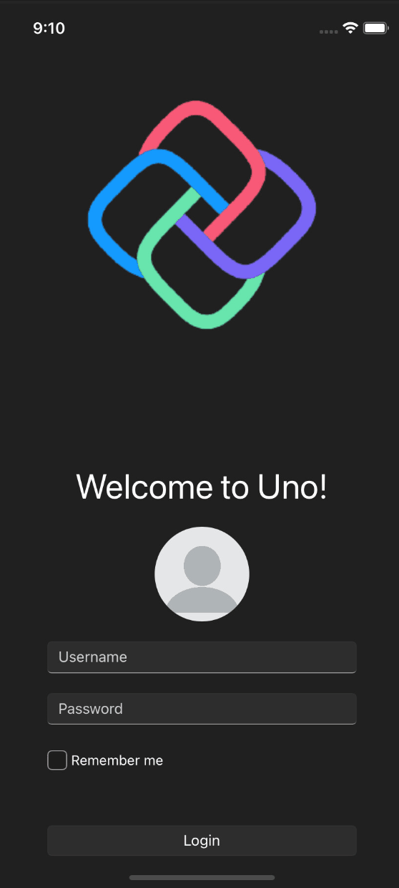

# SafeArea

`SafeArea` is a specialized control that overrides the `Padding` or `Margin` properties of its child/attached control to ensure that its inner content is always within the [`ApplicationView.VisibleBounds`](https://learn.microsoft.com/uwp/api/windows.ui.viewmanagement.applicationview.visiblebounds) rectangle.

The `ApplicationView.VisibleBounds` is the rectangular area of the screen which is completely unobscured by any window decoration, such as the status bar, rounded screen corners, or any type of screen notch.

`SafeArea` can also be used to specify certain areas of the UI that should adapt its layout in order to avoid being covered by any sort of soft-input panel, such as the on-screen keyboard. This is done by observing the state of the keyboard and treating the area that it occupies when open as part of the "unsafe" area of the screen.

In some cases, it is acceptable for visible content to be partially obscured (a page background for example) and it should extend to fill the entire window. Other types of content should be restricted to the visible bounds (for instance: readable text, or interactive controls). `SafeArea` enables this kind of fine-grained control over responsiveness to the safe and "unsafe" areas of the screen.

> [!Video https://www.youtube-nocookie.com/embed/H-HkMzYCiOM]

## Properties

### Remarks

`SafeArea` can be used as a control or as a set of attached properties on another `FrameworkElement`, much like the `ScrollViewer`:

```xml
xmlns:utu="using:Uno.Toolkit.UI"

<!-- as attached property on another FrameworkElement -->
<Grid utu:SafeArea.Insets="Left,Top,Right,Bottom">
    <!-- Content -->
</Grid>

<!-- or, as a control -->
<SafeArea Insets="Left,Top,Right,Bottom">
    <!-- Content -->
</SafeArea>
```

> [!WARNING]
> In most cases, the attached properties and the `SafeArea` control can be used interchangeably. However, be aware that using `SafeArea` as a control while `Insets` contains `InsetMask.SoftInput` will introduce a `ScrollViewer` into the visual tree as the content root of the `SafeArea`. Please refer to the [SoftInput usage section](#using-insetmasksoftinput-for-on-screen-keyboards).

| Property | Type        | Description                                                                                                                                                                 |
|----------|-------------|-----------------------------------------------------------------------------------------------------------------------------------------------------------------------------|
| `Insets` | `InsetMask` | Gets or sets the specific bound(s) of the "safe" area that you want to be considered when `SafeArea` attempts to apply the Padding or Margin. Defaults to `InsetMask.None`. |
| `Mode`   | `InsetMode` | Gets or sets whether the `SafeArea` insets will be applied to the control's `Margin` or its `Padding`. Defaults to `InsetMode.Padding`.                                     |

## Usage

### Using `SafeArea.Insets`

The `InsetMask` enum can represent a single edge/side or it can be composed of multiple values (eg: `InsetMask="Left, Right"`). `InsetMask` has the following available values:

- `Left`
- `Top`
- `Right`
- `Bottom`
- `SoftInput`
- `VisibleBounds = Left | Top | Right | Bottom`
- `All = VisibleBounds | SoftInput`

### Using `InsetMode.Padding` versus `InsetMode.Margin`

The default `Mode` for `SafeArea` is set to `InsetMode.Padding`. Using the Padding property as the `SafeArea` inset ensures that your control's content will never be obscured by the "unsafe" area but still allows things like the control's Background color to "bleed" into the unsafe area. To highlight this feature, refer to the example below.

#### Example

Here we are using the Toolkit's [`TabBar`](TabBarAndTabBarItem.md) with both the `TopTabBarStyle` and the `BottomTabBarStyle`. Both controls have their `Background`s set to `Purple`. Note the differences within the unsafe areas of the screen between the `Padding` mode and the `Margin` mode.

> [!NOTE]
> The `BottomTabBarStyle` uses `SafeArea` and has the `Insets` property set to `Bottom` by default. This is removed from the style for the purpose of the demonstration below.

Given the following XAML, we can see what SafeArea is doing and what the differences are between an `InsetMode` of `Padding` versus `Margin`.

```xml
<Page xmlns:utu="using:Uno.Toolkit.UI">
    <Grid>
        <Grid.RowDefinitions>
            <RowDefinition Height="Auto" />
            <RowDefinition Height="*" />
            <RowDefinition Height="Auto" />
        </Grid.RowDefinitions>
        <utu:TabBar Background="Purple">
            <utu:TabBar.Items>
                <utu:TabBarItem Foreground="White"
                                Content="Home" />
                <utu:TabBarItem Foreground="White"
                                Content="Search" />
                <utu:TabBarItem Foreground="White"
                                Content="Support" />
                <utu:TabBarItem Foreground="White"
                                Content="About" />
            </utu:TabBar.Items>
        </utu:TabBar>

        <TextBlock Text="Page Content"
                    FontSize="30"
                    Grid.Row="1"
                    VerticalAlignment="Center"
                    HorizontalAlignment="Center" />

        <utu:TabBar Grid.Row="2"
                    Background="Purple">
            <utu:TabBar.Items>
                <utu:TabBarItem Foreground="White"
                                Content="Home">
                    <utu:TabBarItem.Icon>
                        <FontIcon Foreground="White"
                                    Glyph="&#xE80F;" />
                    </utu:TabBarItem.Icon>
                </utu:TabBarItem>
                <utu:TabBarItem Foreground="White"
                                Content="Search">
                    <utu:TabBarItem.Icon>
                        <FontIcon Foreground="White"
                                    Glyph="&#xe721;" />
                    </utu:TabBarItem.Icon>
                </utu:TabBarItem>
                <utu:TabBarItem Foreground="White"
                                Content="Support">
                    <utu:TabBarItem.Icon>
                        <FontIcon Foreground="White"
                                    Glyph="&#xE8F2;" />
                    </utu:TabBarItem.Icon>
                </utu:TabBarItem>
                <utu:TabBarItem Foreground="White"
                                Content="About">
                    <utu:TabBarItem.Icon>
                        <FontIcon Foreground="White"
                                    Glyph="&#xE946;" />
                    </utu:TabBarItem.Icon>
                </utu:TabBarItem>
            </utu:TabBar.Items>
        </utu:TabBar>
    </Grid>
</Page>
```

#### [**Without SafeArea**](#tab/none) <!-- markdownlint-disable-line MD051 -->


#### [**Padding (default)**](#tab/padding) <!-- markdownlint-disable-line MD051 -->

Top TabBar:

```diff
<utu:TabBar Background="Purple"
+           utu:SafeArea.Insets="Top">
```

Bottom TabBar:

```diff
<utu:TabBar Grid.Row="2"
+           utu:SafeArea.Insets="Bottom"
            Background="Purple">
```


#### [**Margin**](#tab/margin) <!-- markdownlint-disable-line MD051 -->

Top TabBar:

```diff
<utu:TabBar Background="Purple"
+           utu:SafeArea.Insets="Top"
+           utu:SafeArea.Mode="Margin">
```

Bottom TabBar:

```diff
<utu:TabBar Grid.Row="2"
+           utu:SafeArea.Insets="Bottom"
+           utu:SafeArea.Mode="Margin"
            Background="Purple">
```


---

### Using `InsetMask.SoftInput` for on-screen keyboards

The `InsetMask.SoftInput` value is used to ensure that the specified area will adapt to any sort of soft-input panel that may appear, such as the on-screen keyboard on touch devices. Currently, `SafeArea` is built with the assumption that the soft-input panel would appear at the bottom of the screen.

> [!WARNING]
> Special care must be taken when using `InsetMask.SoftInput` for Android applications. Combining `SafeArea`'s `SoftInput` logic within an Activity whose [`WindowSoftInputMode`](https://developer.android.com/guide/topics/manifest/activity-element#wsoft) is set to `adjustResize` or `adjustPan` may result in undesired behavior, especially when working with text entry controls such as `TextBox` or `PasswordBox`. It is possible to set the `WindowSoftInputMode` to `adjustNothing`. More information on Android specific keyboard behaviors can be found [here](https://developer.android.com/develop/ui/views/touch-and-input/keyboard-input/visibility).
>
> [!IMPORTANT]
> While the `SafeArea` attached properties may be used on any `FrameworkElement`, it is strongly recommended that, when using the `InsetMask.SoftInput` flag, you should either:
>
> - Attach `SafeArea` properties to an existing `ScrollViewer` that is wrapping the content that you would like to adapt to the on-screen keyboard.
> - Or, use `SafeArea` as a control and have it wrap the relevant content. The control will automatically include a `ScrollViewer` that wraps its content as long as the `Insets` property contains `InsetMask.SoftInput`.

Attempting to use `SafeArea` to adapt to the keyboard without including a `ScrollViewer` may not always yield the expected visual result. The behavior of a keyboard-aware `SafeArea` depends on the structure of the layout. For example, a simple login page like the one below can benefit from `SafeArea` to ensure that the Username/Password fields, when in focus, are kept visible above the keyboard.

#### Sample Login Page

Notice in this first example (without `SafeArea` in use) that the Username and Password field are covered by the keyboard and the UI above the keyboard is not scrollable so the relevant views cannot be brought into the visible frame.

<table>
  <tr>
    <th>Page</th>
    <th>XAML</th>
  </tr>
  <tr>
   <td></td>
    <td>

```xml
<Page xmlns:utu="using:Uno.Toolkit.UI" ...>
    <Grid Padding="50,0">
        <Grid.RowDefinitions>
            <!-- 0: Logo, 1: Spacing, 2: FormPanel -->
            <RowDefinition Height="Auto" />
            <RowDefinition Height="40" />
            <RowDefinition Height="*" />
        </Grid.RowDefinitions>
        <!-- Logo -->
        <Image Source="ms-appx:///Assets/uno-logo.png"
               VerticalAlignment="Stretch"
               HorizontalAlignment="Stretch" />
        <!-- FormPanel -->
        <StackPanel Grid.Row="2"
                    x:Name="FormPanel"
                    Spacing="20">
            <TextBlock Text="Welcome to Uno!"
                       HorizontalAlignment="Center"
                       FontSize="35" />
            <PersonPicture ProfilePicture="ms-appx:///Assets/profile.png" />
            <TextBox x:Name="TextBox"
                     PlaceholderText="Username" />
            <PasswordBox x:Name="PasswordBox"
                         PlaceholderText="Password" />
            <StackPanel Orientation="Horizontal"
                        Spacing="4">
                <CheckBox Padding="0"
                          MinWidth="0" />
                <TextBlock Text="Remember me"
                           VerticalAlignment="Center" />
            </StackPanel>
            <Button Content="Login"
                    x:Name="LoginBtn"
                    VerticalAlignment="Top"
                    HorizontalAlignment="Stretch"
                    Margin="0,30" />
        </StackPanel>
    </Grid>
</Page>
```

</td>
  </tr>
</table>

In this next example, we attempt to have the UI adapt to the keyboard by attaching the `SafeArea.Insets` property to the `StackPanel` that contains the login form. We can see that there is no visual change when compared to the previous example where `SafeArea` was not present. This is due to the fact that there are "hard" constraints within the XAML, such as the hardcoded Spacer Grid Row and the `Auto` Row containing Uno logo image.

<table>
  <tr>
    <th>Page</th>
    <th>XAML</th>
  </tr>
  <tr>
   <td></td>
    <td>

```diff
 <StackPanel Grid.Row="2"
             x:Name="FormPanel"
+            utu:SafeArea.Insets="SoftInput"
             Spacing="20">
     <TextBlock Text="Welcome to Uno!"
                HorizontalAlignment="Center"
                FontSize="35" />
     <PersonPicture ProfilePicture="ms-appx:///Assets/profile.png" />
     <TextBox x:Name="TextBox"
              PlaceholderText="Username" />
     <PasswordBox x:Name="PasswordBox"
                  PlaceholderText="Password" />
     <StackPanel Orientation="Horizontal"
                 Spacing="4">
         <CheckBox Padding="0"
                   MinWidth="0" />
         <TextBlock Text="Remember me"
                    VerticalAlignment="Center" />
     </StackPanel>
     <Button Content="Login"
             x:Name="LoginBtn"
             VerticalAlignment="Top"
             HorizontalAlignment="Stretch"
             Margin="0,30" />
 </StackPanel>
```

</td>
</tr>
</table>

The recommended solution in this case would be to use a combination of `SafeArea` and a `ScrollViewer` that will wrap your `Page` content. When using `SafeArea` as a control, a `ScrollViewer` is automatically included as the root element of `SafeArea` as long as the `Insets` property contains the `InsetMask.SoftInput` value.

<table>
  <tr>
    <th>Page</th>
    <th>XAML</th>
  </tr>
  <tr>
   <td></td>
   <td>

```diff
<Page xmlns:utu="using:Uno.Toolkit.UI" ...>
+   <utu:SafeArea Insets="SoftInput">
        <Grid Padding="50,0">
            <Grid.RowDefinitions>
                <!--  0: Logo, 1: Spacer, 2: FormPanel  -->
                <RowDefinition Height="Auto" />
                <RowDefinition Height="40" />
                <RowDefinition Height="*" />
            </Grid.RowDefinitions>
            <!-- logo and form... -->
        </Grid>
+   </utu:SafeArea>
</Page>
```

</td>
  </tr>
</table>

There are alternative usages of `SafeArea` that may be considered in this situation. An example of two alternatives could be:

1. Have your own ScrollViewer defined within the XAML and then you can simply wrap that `ScrollViewer` with any container, such as `Grid`, and use the `SafeArea` attached properties on that wrapping container.

    <table>
    <tr>
        <th>Page</th>
        <th>XAML</th>
    </tr>
    <tr>
    <td></td>
        <td>

    ```diff
    <Page ...
        xmlns:utu="using:Uno.Toolkit.UI">
    +    <Grid utu:SafeArea.Insets="SoftInput">
    +        <ScrollViewer>
                <Grid Padding="50,0">
                    <!--  0: Logo, 1: Spacer, 2: FormPanel  -->
                    <Grid.RowDefinitions>
                        <RowDefinition Height="Auto" />
                        <RowDefinition Height="40" />
                        <RowDefinition Height="*" />
                    </Grid.RowDefinitions>
                    ...
    +            </Grid>
    +        </ScrollViewer>
        </Grid>
    </Page>
    ```

    </td>
    </tr>
    </table>

2. If you do not want to have the whole page scrollable, you could wrap only the FormPanel `StackPanel` within a `SafeArea` instead of the root `Grid`. This may not always have the best visual effect as can be seen in the demonstration below

    <table>
    <tr>
        <th>Page</th>
        <th>XAML</th>
    </tr>
    <tr>
    <td></td>
        <td>

    ```diff
    <Page xmlns:utu="using:Uno.Toolkit.UI">
        ...
    +    <utu:SafeArea Insets="SoftInput"
    +                  Grid.Row="2">
    +        <StackPanel Spacing="20">
    -                    Grid.Row="2">
                <TextBlock Text="Welcome to Uno!"
                            HorizontalAlignment="Center"
                            FontSize="35" />
                <PersonPicture ProfilePicture="ms-appx:///Assets/profile.png" />
                <TextBox x:Name="TextBox"
                            PlaceholderText="Username" />
                <PasswordBox x:Name="PasswordBox"
                                PlaceholderText="Password" />
                <StackPanel Orientation="Horizontal"
                            Spacing="4">
                    <CheckBox Padding="0"
                                MinWidth="0" />
                    <TextBlock Text="Remember me"
                                VerticalAlignment="Center" />
                </StackPanel>
                <Button Content="Login"
                        x:Name="LoginBtn"
                        VerticalAlignment="Top"
                        HorizontalAlignment="Stretch"
                        Margin="0,30" />
            </StackPanel>
    +    </utu:SafeArea>
        ...
    </Page>
    ```

    </td>
    </tr>
    </table>

## Notes

- `SafeArea` is able to adapt to views that are only _partially_ obscured by applying the minimum amount of `Padding`/`Margin` needed until the content is fully inside the visible bounds.
- When a control already has a non-zero `Padding`/`Margin`, `SafeArea` takes those values into consideration when calculating the minimum amount of pixels needed for the view to be within the safe area.
- `SafeArea` on WinAppSDK does not have any effect. It is present to allow for same XAML across platforms.
