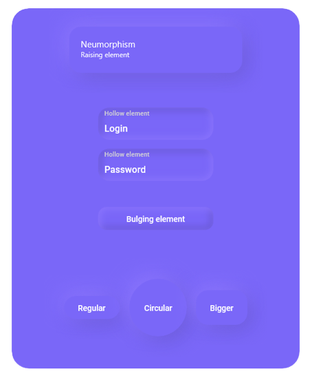

## Summary
The `ShadowContainer` provides the ability to layer multiple shadows to its content.

## Package Reference
A reference to [Uno.Toolkit.Skia.WinUI](https://www.nuget.org/packages/Uno.Toolkit.Skia.WinUI) package must be added to your Uno app so you can access `ShadowContainer` class and its features.

## Remarks
Currently, the control simply mimics the shape of its content by size and by corner radius. Complicated shapes, such as text or pictures with alpha, are not yet supported.

### XAML
```xml
xmlns:utu="using:Uno.Toolkit.UI"
...

<utu:ShadowContainer>
    <utu:ShadowContainer.Shadows>
        <utu:ShadowCollection>
            <utu:Shadow ... />
            <utu:Shadow ... />
        </utu:ShadowCollection>
    </utu:ShadowContainer.Shadows>

    <SomeControl />

</utu:ShadowContainer>
```

### Inheritance
Object &#8594; DependencyObject &#8594; UIElement &#8594; FrameworkElement &#8594; Control &#8594; ContentControl > ShadowContainer

### Properties
| Property | Type             | Description |
| -------- | ---------------- | ----------- |
Shadows  | ShadowCollection |  The collection of shadows that will be displayed under your control. A `ShadowCollection` can be stored in a resource dictionary to have a consistent style throughout your app. The `ShadowCollection` implements `INotifyCollectionChanged`.

## Shadow

Dependency object representing a single shadow.

### Shadow Properties
| Property | Type | Description |
| -------- | ---- | ----------- |
IsInner | bool | True if this shadow is an inner shadow (similar to `inset` of `box-shadow` in CSS).
OffsetX | double | The X offset of the shadow.
OffsetY | double | The Y offset of the shadow.
Color | Color | The color of the shadow. It will be multiplied by the `Opacity` property before rendering.
Opacity | double | The opacity of the shadow.
BlurRadius | double | The radius of the blur that will be applied to the shadow **[0..100]**.
Spread | double | The spread will inflate or deflate (if negative) the control shadow size **before** applying the blur.

As mentioned `IsInner` is similar to `inset` of `box-shadow` in CSS. See the images below that illustrate its effects:

With `inset` an Inner Shadow is rendered.


Without `inset` a Drop (outer) Shadow is rendered.


For more info on how `inset` works in CSS for `box-shadow` follow https://developer.mozilla.org/en-US/docs/Web/CSS/box-shadow#values.

> [!IMPORTANT]
> Be careful not to confuse the `Shadow` property with the `Shadows` property. The singular `Shadow` property comes from `UIElement`. To add shadows to the `ShadowContainer`, use only the `Shadows` property.

## Usage

See how to add shadows to your controls with the following code and the result.

```xml
xmlns:utu="using:Uno.Toolkit.UI"
...

<Page.Resources>
	<Color x:Key="UnoColor">#7a67f8</Color>
	<Color x:Key="UnoPink">#f85977</Color>

	<!-- You can define your shadows in the resource dictionary -->
	<utu:ShadowCollection x:Name="ButtonShadows">
		<utu:Shadow BlurRadius="15"
				   OffsetY="8"
				   Opacity="0.5"
				   Color="{StaticResource UnoColor}" />
	</utu:ShadowCollection>
</Page.Resources>

<utu:ShadowContainer>
	<utu:ShadowContainer.Shadows>
		<!-- You can define your shadows directly -->
		<utu:ShadowCollection x:Name="Shadows">
			<utu:Shadow BlurRadius="20"
					   OffsetX="10"
					   OffsetY="10"
					   Opacity="0.5"
					   Spread="-5"
					   Color="{StaticResource UnoColor}" />
			<utu:Shadow BlurRadius="20"
					   OffsetX="-10"
					   OffsetY="-10"
					   Opacity="0.5"
					   Spread="-5"
					   Color="{StaticResource UnoPink}" />
		</utu:ShadowCollection>
	</utu:ShadowContainer.Shadows>
	<StackPanel Width="300"
				Padding="16"
				Background="White"
				BorderThickness="1"
				CornerRadius="20"
				Spacing="16">

		<TextBlock Style="{StaticResource TitleTextBlockStyle}" Text="Add many shadows" />
		<TextBlock Style="{StaticResource BodyTextBlockStyle}" Text="You can either declare shadows directly, or put your ShadowCollection in a resource dictionary." />

		<StackPanel Margin="0,16,0,0"
					HorizontalAlignment="Center"
					Orientation="Horizontal"
					Spacing="16">

			<!-- Reference to the dictionary button shadows -->
			<utu:ShadowContainer Shadows="{StaticResource ButtonShadows}">
				<Button Background="{StaticResource UnoColor}"
						BorderThickness="1"
						Content="Add Shadow"
						Foreground="White" />
			</utu:ShadowContainer>

			<!-- Reference to the dictionary button shadows -->
			<utu:ShadowContainer Shadows="{StaticResource ButtonShadows}">
				<Button Background="{StaticResource UnoColor}"
						BorderThickness="1"
						Content="Remove Shadow"
						Foreground="White" />
			</utu:ShadowContainer>
		</StackPanel>
	</StackPanel>
</utu:ShadowContainer>
```


## Neumorphism

[Following neumorphism rules](https://neumorphism.io), choose one background color, 2 shadow colors, and create a cool neumorphism style.

To achieve neumorphic depth effects (instead of having a raised element, it will feel as if it was hollow or bulging), set the `IsInner` property of a shadow to `True`. 

 - The shadow will then be displayed *inside* the element instead of behind.
 - This is equivalent to the `inset` property of the CSS `box-shadow` as mentioned previously.

## Usage

See how to integrate neumorphism into your designs with the following code and the result.

```xml
xmlns:utu="using:Uno.Toolkit.UI"
...

<Page.Resources>
	<Color x:Key="UnoColor">#7a67f8</Color>

	<utu:ShadowCollection x:Key="NeumorphismRaising">
		<!-- Bottom right darker violet -->
		<utu:Shadow BlurRadius="30"
				   OffsetX="10"
				   OffsetY="10"
				   Opacity="1"
				   Spread="-5"
				   Color="#6858d3" />
		<!-- Top left lighter violet -->
		<utu:Shadow BlurRadius="30"
				   OffsetX="-10"
				   OffsetY="-10"
				   Opacity="1"
				   Spread="-5"
				   Color="#8c76ff" />
	</utu:ShadowCollection>

	<utu:ShadowCollection x:Key="NeumorphismHollow">
		<!-- Inner top and left shadow -->
		<utu:Shadow BlurRadius="10"
				   IsInner="True"
				   OffsetX="5"
				   OffsetY="5"
				   Opacity="1"
				   Spread="0"
				   Color="#6858d3" />
		<!-- Inner bottom and right shadow -->
		<utu:Shadow BlurRadius="10"
				   IsInner="True"
				   OffsetX="-4"
				   OffsetY="-4"
				   Opacity="1"
				   Spread="0"
				   Color="#8c76ff" />
	</utu:ShadowCollection>

	<utu:ShadowCollection x:Key="NeumorphismBulging">
		<utu:Shadow BlurRadius="10"
				   IsInner="True"
				   OffsetX="-5"
				   OffsetY="-5"
				   Opacity="1"
				   Spread="0"
				   Color="#6858d3" />
		<utu:Shadow BlurRadius="10"
				   IsInner="True"
				   OffsetX="4"
				   OffsetY="4"
				   Opacity="1"
				   Spread="0"
				   Color="#8c76ff" />
	</utu:ShadowCollection>
</Page.Resources>

<StackPanel Width="400"
			Margin="0,32"
			Padding="32"
			Background="{StaticResource UnoColor}"
			CornerRadius="30">
	<utu:ShadowContainer Shadows="{StaticResource NeumorphismRaising}">
		<Grid Width="300"
			  Padding="20"
			  Background="{StaticResource UnoColor}"
			  CornerRadius="20">
			<Grid.RowDefinitions>
				<RowDefinition Height="20" />
				<RowDefinition Height="20" />
			</Grid.RowDefinitions>

			<TextBlock FontSize="15"
					   Foreground="White"
					   Text="Neumorphism" />
			<TextBlock Grid.Row="1"
					   FontSize="12"
					   Foreground="White"
					   Text="Raising element" />
		</Grid>
	</utu:ShadowContainer>

	<utu:ShadowContainer Margin="0,60,0,0" Shadows="{StaticResource NeumorphismHollow}">
		<TextBox Width="200"
				 Height="40"
				 Padding="15,10,15,0"
				 VerticalAlignment="Center"
				 Background="{StaticResource UnoColor}"
				 BorderThickness="0"
				 CornerRadius="20"
				 Foreground="White"
				 PlaceholderForeground="LightGray"
				 PlaceholderText="Hollow element" />
	</utu:ShadowContainer>
	<utu:ShadowContainer Margin="0,15" Shadows="{StaticResource NeumorphismHollow}">
		<TextBox Width="200"
				 Height="40"
				 Padding="15,10,15,0"
				 VerticalContentAlignment="Center"
				 Background="{StaticResource UnoColor}"
				 BorderThickness="0"
				 CornerRadius="20"
				 Foreground="White"
				 PlaceholderForeground="LightGray"
				 PlaceholderText="Hollow element" />
	</utu:ShadowContainer>

	<utu:ShadowContainer Margin="0,30" Shadows="{StaticResource NeumorphismBulging}">
		<Button Width="200"
				Height="40"
				Background="{StaticResource UnoColor}"
				BorderBrush="{StaticResource UnoColor}"
				Content="Bulging element"
				CornerRadius="15"
				Foreground="White" />
	</utu:ShadowContainer>

	<StackPanel Margin="0,30,0,0"
				Padding="24"
				HorizontalAlignment="Center"
				Orientation="Horizontal"
				Spacing="16">

		<utu:ShadowContainer Shadows="{StaticResource NeumorphismRaising}">
			<Button Background="{StaticResource UnoColor}"
					BorderThickness="0"
					Content="Regular"
					Foreground="White" />
		</utu:ShadowContainer>

		<utu:ShadowContainer Shadows="{StaticResource NeumorphismRaising}">
			<Button Width="80"
					Height="80"
					Background="{StaticResource UnoColor}"
					BorderBrush="{StaticResource UnoColor}"
					Content="Circular"
					CornerRadius="40"
					Foreground="White" />
		</utu:ShadowContainer>

		<utu:ShadowContainer Shadows="{StaticResource NeumorphismRaising}">
			<Button Height="60"
					Background="{StaticResource UnoColor}"
					BorderThickness="0"
					Content="Bigger"
					CornerRadius="20"
					Foreground="White" />
		</utu:ShadowContainer>
	</StackPanel>
</StackPanel>
```



## Theme Switching support

To ensure that the Shadows feature seamlessly integrates with [Theme Switching](xref:Uno.Features.Themes), it's essential to include the shadow collection within the theme dictionary.

Here's a snippet demonstrating how to structure your theme dictionary for proper shadow support:

```xml
xmlns:utu="using:Uno.Toolkit.UI"
...

<ResourceDictionary>
	<ResourceDictionary.ThemeDictionaries>
		<ResourceDictionary x:Key="Dark">
			<Color x:Key="LightShadowColor">Pink</Color>
			<Color x:Key="ShadeShadowColor">SkyBlue</Color>

			<utu:ShadowCollection x:Key="ButtonShadows">
				<utu:Shadow BlurRadius="10" 
							IsInner="True" 
							OffsetX="-5" 
							OffsetY="-5" 
							Opacity="1" 
							Spread="0" 
							Color="{StaticResource LightShadowColor}" />
				<utu:Shadow BlurRadius="10" 
							IsInner="True" 
							OffsetX="4" 
							OffsetY="4" 
							Opacity="1" 
							Spread="0" 
							Color="{StaticResource ShadeShadowColor}" />
			</utu:ShadowCollection>
		</ResourceDictionary>
		<ResourceDictionary x:Key="Light">
			<Color x:Key="LightShadowColor">Orange</Color>
			<Color x:Key="ShadeShadowColor">Green</Color>

			<utu:ShadowCollection x:Key="ButtonShadows">
				<utu:Shadow BlurRadius="10" 
							IsInner="True" 
							OffsetX="-5" 
							OffsetY="-5" 
							Opacity="1" 
							Spread="0" 
							Color="{StaticResource LightShadowColor}" />
				<utu:Shadow BlurRadius="10" 
							IsInner="True" 
							OffsetX="4" 
							OffsetY="4" 
							Opacity="1" 
							Spread="0" 
							Color="{StaticResource ShadeShadowColor}" />
			</utu:ShadowCollection>
		</ResourceDictionary>
	</ResourceDictionary.ThemeDictionaries>
</ResourceDictionary>
...

<utu:ShadowContainer Shadows="{ThemeResource ButtonShadows}">
	<Button Width="200"
			Height="40"
			Background="{StaticResource UnoColor}"
			BorderBrush="{StaticResource UnoColor}"
			Content="Save"
			CornerRadius="15"
			Foreground="White" />
</utu:ShadowContainer>
```
