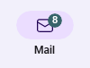

# TabBar & TabBarItem

> [!TIP]
> This guide covers details for `TabBar` and `TabBarItem` specifically. If you are just getting started with the Uno Toolkit Library, please see our [general getting started](../getting-started.md) page to make sure you have the correct setup in place.
>
> [!Video https://www.youtube-nocookie.com/embed?listType=playlist&list=PLl_OlDcUya9qONoKVz4uGGsEeDbGuaIo_]
For more information and detailed walkthroughs on using TabBar and TabBarItem, please refer to the rest of the [video playlist](https://www.youtube.com/playlist?list=PLl_OlDcUya9qONoKVz4uGGsEeDbGuaIo_).

## Summary

Represents a control that provides a list of `TabItem`s to select from. The `TabBar` selection can be used to trigger frame navigation or to toggle the visibility of views.

## TabBarItem

`TabBarItem` is a specialized `SelectorItem` that includes functionality such as triggering an `ICommand` on click/tap or displaying a flyout.

### C\#

```csharp
public partial class TabBarItem : SelectorItem
```

### XAML

```xml
xmlns:utu="using:Uno.Toolkit.UI"
...

<utu:TabBarItem Content="..." />
-or-
<utu:TabBarItem ...>
    content
</utu:TabBarItem>
```

### Inheritance

`Object` &#8594; `DependencyObject` &#8594; `UIElement` &#8594; `FrameworkElement` &#8594; `Control` &#8594; `ContentControl` &#8594; `SelectorItem` &#8594; `TabBarItem`

### Constructors

| Constructor    | Description                                           |
|----------------|-------------------------------------------------------|
| `TabBarItem()` | Initializes a new instance of the `TabBarItem` class. |

### Properties

| Property           | Type          | Description                                                                                                                                                                                                                                                                                    |
|--------------------|---------------|------------------------------------------------------------------------------------------------------------------------------------------------------------------------------------------------------------------------------------------------------------------------------------------------|
| `BadgeValue`       | `string`      | Gets or sets the value to be displayed in the badge of the `TabBarItem`. If a value is set the large badge will be displayed otherwise it will be the small badge. (Currently only supported by the Material Theme Toolkit Library with `BottomTabBarItemStyle` and `VerticalTabBarItemStyle`) |
| `BadgeVisibility`  | `Visibility`  | Gets or sets the badge visibility of the `TabBarItem`. (Currently only supported by the Material Theme Toolkit Library with `BottomTabBarItemStyle` and `VerticalTabBarItemStyle`)                                                                                                             |
| `Command`          | `ICommand`    | Gets or sets the command to invoke when the `TabBarItem` is pressed.                                                                                                                                                                                                                           |
| `CommandParameter` | `object`      | Gets or sets the parameter to pass to the `Command` property.                                                                                                                                                                                                                                  |
| `Flyout`           | `double`      | Gets or sets the flyout associated with this `TabBarItem`.                                                                                                                                                                                                                                     |
| `Icon`             | `IconElement` | Gets or sets the icon of the `TabBarItem`.                                                                                                                                                                                                                                                     |
| `IsSelectable`     | `bool`        | Gets or sets whether the `TabBarItem` can be selected.                                                                                                                                                                                                                                         |

### Events

| Event   | Type                 | Description                              |
|---------|----------------------|------------------------------------------|
| `Click` | `RoutedEventHandler` | Occurs when the `TabBarItem` is pressed. |

## TabBar

`TabBar` is a specialized `ItemsControl` used to present a collection of `TabBarItem`s.

### C\#

```csharp
public partial class TabBar : ItemsControl
```

### XAML

```xml
xmlns:utu="using:Uno.Toolkit.UI"
...

<utu:TabBar .../>
-or-
<utu:TabBar ...>
    oneOrMoreItems
</utu:TabBar>
-or-
<utu:TabBar ...>
    <utu:TabBar.Items>
          oneOrMoreItems
      </utu:TabBar.Items>
</utu:TabBar>
```

### Inheritance

`Object` &#8594; `DependencyObject` &#8594; `UIElement` &#8594; `FrameworkElement` &#8594; `Control` &#8594; `ItemsControl` &#8594; `TabBar`

### Constructors

| Constructor | Description                                       |
|-------------|---------------------------------------------------|
| `TabBar()`  | Initializes a new instance of the `TabBar` class. |

### Properties

| Property                            | Type                      | Description                                                                                                                                                 |
|-------------------------------------|---------------------------|-------------------------------------------------------------------------------------------------------------------------------------------------------------|
| `SelectedIndex`                     | `int`                     | Gets or sets the index of the selected item.                                                                                                                |
| `SelectedItem`                      | `object`                  | Gets or sets the selected item.                                                                                                                             |
| `Orientation`                       | `Orientation`             | Gets or sets the dimension by which the items are stacked                                                                                                   |
| `SelectionIndicatorContent`         | `object`                  | Gets or sets the content to be displayed as the selection indicator                                                                                         |
| `SelectionIndicatorContentTemplate` | `DataTemplate`            | Gets or sets the data template that is used to display the content of the selection indicator                                                               |
| `SelectionIndicatorPresenterStyle`  | `Style`                   | Gets or sets the style to be applied for the content of the `TabBarSelectionIndicatorPresenter`                                                             |
| `SelectionIndicatorTransitionMode`  | `IndicatorTransitionMode` | Gets or sets the behavior of the selection indicator. The indicator can either slide or snap to the newly selected item. Defaults to `Snap`                 |
| `SelectionIndicatorPlacement`       | `IndicatorPlacement`      | Gets or sets the placement of the selection indicator. The indicator can either be displayed `Above` or `Below` the TabBarItem Content. Defaults to `Above` |

> [!NOTE]
> `TabBar` only supports the single selection mode.

### Events

All events below are forwarded from the nested `TabBarItem`s:

| Event              | Type                                                         | Description                                               |
|--------------------|--------------------------------------------------------------|-----------------------------------------------------------|
| `SelectionChanged` | `TypedEventHandler<TabBar, TabBarSelectionChangedEventArgs>` | Occurs when a `TabBarItem`'s selection state has changed. |

```csharp
class TabBarSelectionChangedEventArgs : EventArgs
{
    // Gets the newly selected TabBarItem
    object? NewItem { get; }

    // Gets the previously selected TabBarItem
    object? OldItem { get; }
}
```

## Selection Indicator

By default, the `TabBar` does not display an indicator for the currently selected item. If a selection indicator is needed, it can be defined by setting the `SelectionIndicatorContent` and/or `SelectionIndicatorContentTemplate` properties on `TabBar`. If the content for the indicator is defined, the `TabBar` will automatically display and position the indicator based on the `SelectionIndicatorTransitionMode`.

As an example, given the following `TabBar`:

```xml
xmlns:utu="using:Uno.Toolkit.UI"
...

<utu:TabBar Style="{StaticResource MyCustomTabBarStyle}"
            SelectedIndex="0">
    <utu:TabBar.SelectionIndicatorContent>
        <Border Height="2"
                VerticalAlignment="Bottom"
                Background="Red" />
    </utu:TabBar.SelectionIndicatorContent>
    <utu:TabBar.Items>
        <utu:TabBarItem Content="HOME">
            <utu:TabBarItem.Icon>
                <SymbolIcon Symbol="Home" />
            </utu:TabBarItem.Icon>
        </utu:TabBarItem>
        <utu:TabBarItem Content="SUPPORT">
            <utu:TabBarItem.Icon>
                <FontIcon Glyph="&#xE8F2;" />
            </utu:TabBarItem.Icon>
        </utu:TabBarItem>
        <utu:TabBarItem Content="ABOUT">
            <utu:TabBarItem.Icon>
                <FontIcon Glyph="&#xE946;" />
            </utu:TabBarItem.Icon>
        </utu:TabBarItem>
    </utu:TabBar.Items>
</utu:TabBar>
```

The result would be:


### IndicatorTransitionMode

The selection indicator has two different transition modes:

- `IndicatorTransitionMode.Snap` (default mode):

  

- `IndicatorTransitionMode.Slide`:

  

### IndicatorPlacement

By default, the selection indicator is rendered above, on "on top" of, the actual content in the TabBar. For example, the following XAML will result in the screenshot below:

```xml
<utu:TabBar Margin="50"
            Width="300"
            SelectedIndex="1"
            Background="Green"
            VerticalAlignment="Center">
    <utu:TabBar.Items>
        <utu:TabBarItem Content="Tab 1" />
        <utu:TabBarItem Content="Tab 2" />
        <utu:TabBarItem Content="Tab 3" />
    </utu:TabBar.Items>
    <utu:TabBar.SelectionIndicatorContentTemplate>
        <DataTemplate>
            <Border Background="Red" />
        </DataTemplate>
    </utu:TabBar.SelectionIndicatorContentTemplate>
</utu:TabBar>
```


The `SelectionIndicatorPlacement` property can be used to render the selection indicator "below" the content so it does not obscure the `TabBarItem`:

```xml
<utu:TabBar Margin="50"
            Width="300"
            SelectedIndex="1"
            Background="Green"
            SelectionIndicatorPlacement="Below"
            VerticalAlignment="Center">
    <utu:TabBar.Items>
        <utu:TabBarItem Content="Tab 1" />
        <utu:TabBarItem Content="Tab 2" />
        <utu:TabBarItem Content="Tab 3" />
    </utu:TabBar.Items>
    <utu:TabBar.SelectionIndicatorContentTemplate>
        <DataTemplate>
            <Border Background="Red" />
        </DataTemplate>
    </utu:TabBar.SelectionIndicatorContentTemplate>
</utu:TabBar>
```


### Further Customization

If further customization is required, such as custom animations when sliding the indicator, there is a `SelectionIndicatorPresenterStyle` property on `TabBar` that can be set to customize the style of the internal `ContentPresenter` that is used to display the selection indicator.

## Styling `TabBar` & `TabBarItem`

Toolkit provides a barebones default style for `TabBar` and `TabBarItem`. It is recommended to use either:

- [One of the pre-built styles](../controls-styles.md#control-styles) that come packaged within the `Uno.Toolkit.UI.Material` or `Uno.Toolkit.UI.Cupertino` libraries
- A custom-built style that is defined within the consuming application

The styles that exist within the Toolkit Theming Libraries are built for the most common scenarios in which a `TabBar` could be used.

### "Top" `TabBar` Style

A common use for a `TabBar` would be to use it as a means of navigation between two or more views/pages that are all at the same level of hierarchy (Lateral Navigation). If the goal is to provide lateral navigation for destinations that are at **any** level of the hierarchy, a `TabBar` styled as a `TopTabBar` is most appropriate.

Currently, the Material Theme Toolkit Library contains two styles for this purpose: `ColoredTopTabBarStyle` and `TopTabBarStyle`.

```xml
xmlns:utu="using:Uno.Toolkit.UI"
...

<utu:TabBar SelectedIndex="1"
            Style="{StaticResource ColoredTopTabBarStyle}">
    <utu:TabBar.Items>
        <utu:TabBarItem Content="Home" />
        <utu:TabBarItem Content="Search" />
        <utu:TabBarItem Content="Support" />
        <utu:TabBarItem Content="About" />
    </utu:TabBar.Items>
</utu:TabBar>
```


### "Bottom" `TabBar` Style

Following the explanation of Lateral Navigation and the use case for "Top" `TabBar` styles, another common scenario is to use `TabBar` as an application's primary navigation component. In this case, we want a component that would provide lateral navigation to all **top-level** destinations. In this case, a `TabBar` styled as a `BottomTabBar` is most appropriate.

Currently, both the Material and Cupertino Theme Toolkit Libraries contain a `BottomTabBarStyle`.

```xml
xmlns:utu="using:Uno.Toolkit.UI"
...

<utu:TabBar SelectedIndex="1"
            Style="{StaticResource BottomTabBarStyle}">
    <utu:TabBarItem>
        <utu:TabBarItem.Icon>
            <SymbolIcon Symbol="Home" />
        </utu:TabBarItem.Icon>
    </utu:TabBarItem>
    <utu:TabBarItem>
        <utu:TabBarItem.Icon>
            <SymbolIcon Symbol="Find" />
        </utu:TabBarItem.Icon>
    </utu:TabBarItem>
    <utu:TabBarItem>
        <utu:TabBarItem.Icon>
            <SymbolIcon Symbol="Help" />
        </utu:TabBarItem.Icon>
    </utu:TabBarItem>
    <utu:TabBarItem>
        <utu:TabBarItem.Icon>
            <SymbolIcon Symbol="Flag" />
        </utu:TabBarItem.Icon>
    </utu:TabBarItem>
</utu:TabBar>
```

#### Material


#### Cupertino


### "Vertical" `TabBar` Style

Along with using the "Bottom" `TabBar`, Toolkit also provides a "Vertical" `TabBar` to use as an application's primary navigation component.  In this case, we want a component that would provide lateral navigation to all **top-level** destinations.

Currently, only the Material Theme Toolkit Library contains a `VerticalTabBarStyle`.

```xml
xmlns:utu="using:Uno.Toolkit.UI"
...

<utu:TabBar SelectedIndex="1"
            Style="{StaticResource VerticalTabBarStyle}">
    <utu:TabBarItem>
        <utu:TabBarItem.Icon>
            <SymbolIcon Symbol="Home" />
        </utu:TabBarItem.Icon>
    </utu:TabBarItem>
    <utu:TabBarItem>
        <utu:TabBarItem.Icon>
            <SymbolIcon Symbol="Find" />
        </utu:TabBarItem.Icon>
    </utu:TabBarItem>
    <utu:TabBarItem>
        <utu:TabBarItem.Icon>
            <SymbolIcon Symbol="Help" />
        </utu:TabBarItem.Icon>
    </utu:TabBarItem>
    <utu:TabBarItem>
        <utu:TabBarItem.Icon>
            <SymbolIcon Symbol="Flag" />
        </utu:TabBarItem.Icon>
    </utu:TabBarItem>
</utu:TabBar>
```

#### Material


There are some styles that are built specifically for the Cupertino theme. These styles are used to emulate a [`UISegmentedControl`](https://developer.apple.com/documentation/uikit/uisegmentedcontrol)

```xml
xmlns:utu="using:Uno.Toolkit.UI"
...

<utu:TabBar Style="{StaticResource SegmentedStyle}">
    <utu:TabBar.Items>
        <utu:TabBarItem Content="ORANGE" />
        <utu:TabBarItem Content="PURPLE" />
        <utu:TabBarItem Content="BLUE" />
    </utu:TabBar.Items>
</utu:TabBar>

<utu:TabBar Style="{StaticResource SlidingSegmentedStyle}">
    <utu:TabBar.Items>
        <utu:TabBarItem Content="ORANGE" />
        <utu:TabBarItem Content="PURPLE" />
        <utu:TabBarItem Content="BLUE" />
    </utu:TabBar.Items>
</utu:TabBar>
```


### `TabBarItem` Style

The Uno Toolkit provides several styles of `TabBarItem` for both Material and Cupertino themes.

| Style Key                   | Material | Cupertino |
|-----------------------------|----------|-----------|
| `BottomFabTabBarItemStyle`  | &check;  |           |
| `BottomTabBarItemStyle`     | &check;  | &check;   |
| `ColoredTopTabBarItemStyle` | &check;  |           |
| `SegmentedItemStyle`        |          | &check;   |
| `SlidingSegmentedItemStyle` | &check;  |           |
| `TopTabBarItemStyle`        | &check;  |           |
| `VerticalTabBarItemStyle`   | &check;  |           |

These pre-built styles can be used for more complex `TabBar` scenarios. For example, using the BottomFabTabBarItemStyle, we can embed Floating Action Buttons into the `TabBar`.

```xml
xmlns:utu="using:Uno.Toolkit.UI"
...

<utu:TabBar SelectedIndex="1"
            Style="{StaticResource BottomTabBarStyle}">
    <utu:TabBar.Items>
        <utu:TabBarItem Content="Home">
            <utu:TabBarItem.Icon>
                <FontIcon Glyph="&#xE80F;" />
            </utu:TabBarItem.Icon>
        </utu:TabBarItem>
        <utu:TabBarItem Content="Search">
            <utu:TabBarItem.Icon>
                <FontIcon Glyph="&#xe721;" />
            </utu:TabBarItem.Icon>
        </utu:TabBarItem>
        <utu:TabBarItem Style="{StaticResource BottomFabTabBarItemStyle}">
            <utu:TabBarItem.Flyout>
                <MenuFlyout MenuFlyoutPresenterStyle="{StaticResource MenuFlyoutPresenterStyle}"
                            Placement="Top">

                    <MenuFlyoutItem Style="{StaticResource MenuFlyoutItemStyle}"
                                    Text="Like">
                        <MenuFlyoutItem.Icon>
                            <SymbolIcon Symbol="Like" />
                        </MenuFlyoutItem.Icon>
                    </MenuFlyoutItem>

                    <MenuFlyoutItem Style="{StaticResource MenuFlyoutItemStyle}"
                                    Text="Dislike">
                        <MenuFlyoutItem.Icon>
                            <SymbolIcon Symbol="Dislike" />
                        </MenuFlyoutItem.Icon>
                    </MenuFlyoutItem>
                </MenuFlyout>
            </utu:TabBarItem.Flyout>
            <utu:TabBarItem.Icon>
                <SymbolIcon Symbol="Add" />
            </utu:TabBarItem.Icon>
        </utu:TabBarItem>
        <utu:TabBarItem Content="Support">
            <utu:TabBarItem.Icon>
                <FontIcon Glyph="&#xE8F2;" />
            </utu:TabBarItem.Icon>
        </utu:TabBarItem>
        <utu:TabBarItem Content="About">
            <utu:TabBarItem.Icon>
                <FontIcon Glyph="&#xE946;" />
            </utu:TabBarItem.Icon>
        </utu:TabBarItem>
    </utu:TabBar.Items>
</utu:TabBar>
```


#### Badge usage for the Material `TabBar` styles

Icons in `TabBar` items can display badges in their upper right corners.

Badges can contain dynamic information, such as the number of new messages.

Currently, only the Material Theme Toolkit Library contains a `BottomTabBarItemStyle` or `VerticalTabBarItemStyle` that you can use to display a badge (which is optional).


##### Small Badge

A small badge uses only shape to indicate a status change or new notification.


```xml
xmlns:utu="using:Uno.Toolkit.UI"
...

<utu:TabBarItem Content="Favorites"
                BadgeVisibility="Visible"
                Style="{StaticResource BottomTabBarItemStyle}">
    <utu:TabBarItem.Icon>
        <FontIcon Glyph="&#xE113;" />
    </utu:TabBarItem.Icon>
</utu:TabBarItem>
```

##### Large Badge

A large badge displays a number within a container to indicate a quantifiable status change related to a destination.



```xml
xmlns:utu="using:Uno.Toolkit.UI"
...

<utu:TabBarItem Content="Mail"
                BadgeValue="8"
                BadgeVisibility="Visible"
                Style="{StaticResource BottomTabBarItemStyle}">
    <utu:TabBarItem.Icon>
        <FontIcon Glyph="&#xE119;" />
    </utu:TabBarItem.Icon>
</utu:TabBarItem>
```

## Lightweight Styling

| Key                                                                  | Type            | Value                                        |
|----------------------------------------------------------------------|-----------------|----------------------------------------------|
| `NavigationTabBarWidthOrHeight`                                    | `Double`          | 80                                           |
| `NavigationTabBarTintOpacity`                                      | `Double`          | 0.8                                          |
| `NavigationTabBarItemIconHeight`                                   | `Double`          | 18                                           |
| `NavigationTabBarItemActiveIndicatorWidth`                         | `Double`          | 64                                           |
| `NavigationTabBarItemActiveIndicatorHeight`                        | `Double`          | 32                                           |
| `NavigationTabBarItemPadding`                                      | `Thickness`       | 0,12,0,16                                    |
| `NavigationTabBarItemActiveIndicatorCornerRadius`                  | `CornerRadius`    | 16                                           |
| `TopTabBarHeight`                                                  | `Double`          | 48                                           |
| `TopTabBarItemIconHeight`                                          | `Double`          | 20                                           |
| `TopTabBarItemContentMargin`                                       | `Thickness`       | 0                                            |
| `FabTabBarItemOffset`                                              | `Double`          | -32                                          |
| `FabTabBarItemContentWidthOrHeight`                                | `Double`          | 16                                           |
| `FabTabBarItemIconTextPadding`                                     | `Double`          | 12                                           |
| `FabTabBarItemCornerRadius`                                        | `CornerRadius`    | 16                                           |
| `FabTabBarItemPadding`                                             | `Thickness`       | 20                                           |
| `NavigationTabBarItemSmallBadgeHeight`                             | `Double`          | 6                                            |
| `NavigationTabBarItemSmallBadgeWidth`                              | `Double`          | 6                                            |
| `NavigationTabBarItemSmallBadgeMargin`                             | `Thickness`       | 0,4,20,0                                     |
| `NavigationTabBarItemLargeBadgeHeight`                             | `Double`          | 16                                           |
| `NavigationTabBarItemLargeBadgeMinWidth`                           | `Double`          | 16                                           |
| `NavigationTabBarItemLargeBadgeMargin`                             | `Thickness`       | 32,2,0,0                                     |
| `NavigationTabBarItemLargeBadgePadding`                            | `Thickness`       | 4,0                                          |
| `NavigationTabBarItemLargeBadgeCornerRadius`                       | `CornerRadius`    | 8                                            |
| `VerticalTabBarBackground`                                         | `SolidColorBrush` | SurfaceBrush                                 |
| `BottomTabBarBackground`                                           | `SolidColorBrush` | SurfaceBrush                                 |
| `TopTabBarBackground`                                              | `SolidColorBrush` | BackgroundBrush                              |
| `TopTabBarBottomBorderBrush`                                       | `SolidColorBrush` | PrimaryBrush                                 |
| `ColoredTopTabBarBackground`                                       | `SolidColorBrush` | PrimaryBrush                                 |
| `ColoredTopTabBarBottomBorderBrush`                                | `SolidColorBrush` | OnPrimaryBrush                               |
| `ColoredTopTabBarItemBackground`                                   | `SolidColorBrush` | SystemControlTransparentBrush                |
| `ColoredTopTabBarItemBackgroundPointerOver`                        | `SolidColorBrush` | OnPrimaryHoverBrush                          |
| `ColoredTopTabBarItemBackgroundFocused`                            | `SolidColorBrush` | OnPrimaryLowBrush                            |
| `ColoredTopTabBarItemBackgroundPressed`                            | `SolidColorBrush` | OnPrimaryPressedBrush                        |
| `ColoredTopTabBarItemBackgroundDisabled`                           | `SolidColorBrush` | SystemControlTransparentBrush                |
| `ColoredTopTabBarItemBackgroundSelected`                           | `SolidColorBrush` | SystemControlTransparentBrush                |
| `ColoredTopTabBarItemBackgroundSelectedPointerOver`                | `SolidColorBrush` | OnPrimaryHoverBrush                          |
| `ColoredTopTabBarItemBackgroundSelectedPressed`                    | `SolidColorBrush` | OnPrimaryPressedBrush                        |
| `ColoredTopTabBarItemForeground`                                   | `SolidColorBrush` | OnPrimaryMediumBrush                         |
| `ColoredTopTabBarItemForegroundPointerOver`                        | `SolidColorBrush` | OnPrimaryMediumBrush                         |
| `ColoredTopTabBarItemForegroundFocused`                            | `SolidColorBrush` | OnPrimaryMediumBrush                         |
| `ColoredTopTabBarItemForegroundPressed`                            | `SolidColorBrush` | OnPrimaryMediumBrush                         |
| `ColoredTopTabBarItemForegroundDisabled`                           | `SolidColorBrush` | SystemControlDisabledBaseMediumLowBrush      |
| `ColoredTopTabBarItemForegroundSelected`                           | `SolidColorBrush` | OnPrimaryBrush                               |
| `ColoredTopTabBarItemForegroundSelectedPointerOver`                | `SolidColorBrush` | OnPrimaryBrush                               |
| `ColoredTopTabBarItemForegroundSelectedPressed`                    | `SolidColorBrush` | OnPrimaryBrush                               |
| `ColoredTopTabBarItemIconForeground`                               | `SolidColorBrush` | SystemControlTransparentBrush                |
| `ColoredTopTabBarItemIconForegroundPointerOver`                    | `SolidColorBrush` | OnPrimaryMediumBrush                         |
| `ColoredTopTabBarItemIconForegroundFocused`                        | `SolidColorBrush` | SystemControlTransparentBrush                |
| `ColoredTopTabBarItemIconForegroundPressed`                        | `SolidColorBrush` | OnPrimaryMediumBrush                         |
| `ColoredTopTabBarItemIconForegroundDisabled`                       | `SolidColorBrush` | SystemControlDisabledBaseMediumLowBrush      |
| `ColoredTopTabBarItemIconForegroundSelected`                       | `SolidColorBrush` | OnPrimaryBrush                               |
| `ColoredTopTabBarItemIconForegroundSelectedPointerOver`            | `SolidColorBrush` | OnPrimaryBrush                               |
| `ColoredTopTabBarItemIconForegroundSelectedPressed`                | `SolidColorBrush` | OnPrimaryBrush                               |
| `ColoredTopTabBarItemPointerFillBrush`                             | `SolidColorBrush` | SystemControlTransparentBrush                |
| `ColoredTopTabBarItemPointerFillBrushPointerOver`                  | `SolidColorBrush` | OnPrimaryHoverBrush                          |
| `ColoredTopTabBarItemPointerFillBrushFocused`                      | `SolidColorBrush` | OnPrimaryLowBrush                            |
| `ColoredTopTabBarItemPointerFillBrushPressed`                      | `SolidColorBrush` | OnPrimaryPressedBrush                        |
| `ColoredTopTabBarItemPointerFillBrushDisabled`                     | `SolidColorBrush` | SystemControlTransparentBrush                |
| `ColoredTopTabBarItemPointerFillBrushSelected`                     | `SolidColorBrush` | SystemControlTransparentBrush                |
| `ColoredTopTabBarItemPointerFillBrushSelectedPointerOver`          | `SolidColorBrush` | OnPrimaryHoverBrush                          |
| `ColoredTopTabBarItemPointerFillBrushSelectedPressed`              | `SolidColorBrush` | OnPrimaryPressedBrush                        |
| `ColoredTopTabBarItemRippleFeedback`                               | `SolidColorBrush` | PrimaryBrush                                 |
| `FabTabBarItemBackground`                                          | `SolidColorBrush` | PrimaryContainerBrush                        |
| `FabTabBarItemBackgroundPointerOver`                               | `SolidColorBrush` | OnPrimaryContainerHoverBrush                 |
| `FabTabBarItemBackgroundFocused`                                   | `SolidColorBrush` | OnPrimaryContainerFocusedBrush               |
| `FabTabBarItemBackgroundPressed`                                   | `SolidColorBrush` | OnPrimaryContainerPressedBrush               |
| `FabTabBarItemBackgroundDisabled`                                  | `SolidColorBrush` | OnSurfaceDisabledBrush                    |
| `FabTabBarItemBackgroundSelected`                                  | `SolidColorBrush` | SystemControlTransparentBrush                |
| `FabTabBarItemBackgroundSelectedPointerOver`                       | `SolidColorBrush` | SystemControlTransparentBrush                |
| `FabTabBarItemBackgroundSelectedPressed`                           | `SolidColorBrush` | SystemControlTransparentBrush                |
| `FabTabBarItemForeground`                                          | `SolidColorBrush` | OnPrimaryContainerBrush                      |
| `FabTabBarItemForegroundPointerOver`                               | `SolidColorBrush` | OnPrimaryContainerBrush                      |
| `FabTabBarItemForegroundFocused`                                   | `SolidColorBrush` | OnPrimaryContainerBrush                      |
| `FabTabBarItemForegroundPressed`                                   | `SolidColorBrush` | OnPrimaryContainerBrush                      |
| `FabTabBarItemForegroundDisabled`                                  | `SolidColorBrush` | OnSurfaceDisabledBrush                       |
| `FabTabBarItemForegroundSelected`                                  | `SolidColorBrush` | SystemControlTransparentBrush                |
| `FabTabBarItemForegroundSelectedPointerOver`                       | `SolidColorBrush` | SystemControlTransparentBrush                |
| `FabTabBarItemForegroundSelectedPressed`                           | `SolidColorBrush` | SystemControlTransparentBrush                |
| `FabTabBarItemIconForeground`                                      | `SolidColorBrush` | SystemControlTransparentBrush                |
| `FabTabBarItemIconForegroundPointerOver`                           | `SolidColorBrush` | SystemControlTransparentBrush                |
| `FabTabBarItemIconForegroundFocused`                               | `SolidColorBrush` | SystemControlTransparentBrush                |
| `FabTabBarItemIconForegroundPressed`                               | `SolidColorBrush` | SystemControlTransparentBrush                |
| `FabTabBarItemIconForegroundDisabled`                              | `SolidColorBrush` | OnSurfaceDisabledBrush                       |
| `FabTabBarItemIconForegroundSelected`                              | `SolidColorBrush` | SystemControlTransparentBrush                |
| `FabTabBarItemIconForegroundSelectedPointerOver`                   | `SolidColorBrush` | SystemControlTransparentBrush                |
| `FabTabBarItemIconForegroundSelectedPressed`                       | `SolidColorBrush` | SystemControlTransparentBrush                |
| `NavigationTabBarItemActiveIndicatorBackground`                    | `SolidColorBrush` | SystemControlTransparentBrush                |
| `NavigationTabBarItemActiveIndicatorBackgroundPointerOver`         | `SolidColorBrush` | OnSurfaceVariantHoverBrush                   |
| `NavigationTabBarItemActiveIndicatorBackgroundPressed`             | `SolidColorBrush` | OnSurfaceVariantPressedBrush                 |
| `NavigationTabBarItemActiveIndicatorBackgroundDisabled`            | `SolidColorBrush` | SystemControlTransparentBrush                |
| `NavigationTabBarItemActiveIndicatorBackgroundSelected`            | `SolidColorBrush` | SecondaryContainerBrush                      |
| `NavigationTabBarItemActiveIndicatorBackgroundSelectedPointerOver` | `SolidColorBrush` | OnSurfaceHoverBrush                          |
| `NavigationTabBarItemActiveIndicatorBackgroundSelectedPressed`     | `SolidColorBrush` | OnSurfacePressedBrush                        |
| `NavigationTabBarItemIconForeground`                               | `SolidColorBrush` | SystemControlTransparentBrush                |
| `NavigationTabBarItemIconForegroundPointerOver`                    | `SolidColorBrush` | OnSurfaceVariantBrush                        |
| `NavigationTabBarItemIconForegroundPressed`                        | `SolidColorBrush` | OnSurfaceVariantBrush                        |
| `NavigationTabBarItemIconForegroundDisabled`                       | `SolidColorBrush` | SystemControlDisabledBaseMediumLowBrush      |
| `NavigationTabBarItemIconForegroundSelected`                       | `SolidColorBrush` | OnSecondaryContainerBrush                    |
| `NavigationTabBarItemIconForegroundSelectedPointerOver`            | `SolidColorBrush` | OnSecondaryContainerBrush                    |
| `NavigationTabBarItemIconForegroundSelectedPressed`                | `SolidColorBrush` | OnSecondaryContainerBrush                    |
| `NavigationTabBarItemErrorBrush`                                   | `SolidColorBrush` | ErrorBrush                                   |
| `NavigationTabBarItemOnErrorBrush`                                 | `SolidColorBrush` | OnErrorBrush                                 |
| `NavigationTabBarItemPointerFillBrush`                             | `SolidColorBrush` | SystemControlTransparentBrush                |
| `NavigationTabBarItemRippleFeedback`                               | `SolidColorBrush` | OnSurfaceBrush                               |
| `TopTabBarItemBackground`                                          | `SolidColorBrush` | SystemControlTransparentBrush                |
| `TopTabBarItemBackgroundPointerOver`                               | `SolidColorBrush` | PrimaryHoverBrush                            |
| `TopTabBarItemBackgroundFocused`                                   | `SolidColorBrush` | PrimaryLowBrush                              |
| `TopTabBarItemBackgroundPressed`                                   | `SolidColorBrush` | PrimaryPressedBrush                          |
| `TopTabBarItemBackgroundDisabled`                                  | `SolidColorBrush` | SystemControlTransparentBrush                |
| `TopTabBarItemBackgroundSelected`                                  | `SolidColorBrush` | SystemControlTransparentBrush                |
| `TopTabBarItemBackgroundSelectedPointerOver`                       | `SolidColorBrush` | PrimaryHoverBrush                            |
| `TopTabBarItemBackgroundSelectedPressed`                           | `SolidColorBrush` | PrimaryPressedBrush                          |
| `TopTabBarItemForeground`                                          | `SolidColorBrush` | OnSurfaceMediumBrush                         |
| `TopTabBarItemForegroundPointerOver`                               | `SolidColorBrush` | OnSurfaceMediumBrush                         |
| `TopTabBarItemForegroundFocused`                                   | `SolidColorBrush` | OnSurfaceMediumBrush                         |
| `TopTabBarItemForegroundPressed`                                   | `SolidColorBrush` | OnSurfaceMediumBrush                         |
| `TopTabBarItemForegroundDisabled`                                  | `SolidColorBrush` | SystemControlDisabledBaseMediumLowBrush      |
| `TopTabBarItemForegroundSelected`                                  | `SolidColorBrush` | PrimaryBrush                                 |
| `TopTabBarItemForegroundSelectedPointerOver`                       | `SolidColorBrush` | PrimaryBrush                                 |
| `TopTabBarItemForegroundSelectedPressed`                           | `SolidColorBrush` | PrimaryBrush                                 |
| `TopTabBarItemBorderBrush`                                         | `SolidColorBrush` | SystemControlTransparentBrush                |
| `TopTabBarItemIconForeground`                                      | `SolidColorBrush` | SystemControlTransparentBrush                |
| `TopTabBarItemIconForegroundPointerOver`                           | `SolidColorBrush` | OnSurfaceMediumBrush                         |
| `TopTabBarItemIconForegroundFocused`                               | `SolidColorBrush` | SystemControlTransparentBrush                |
| `TopTabBarItemIconForegroundPressed`                               | `SolidColorBrush` | OnSurfaceMediumBrush                         |
| `TopTabBarItemIconForegroundDisabled`                              | `SolidColorBrush` | SystemControlDisabledBaseMediumLowBrush      |
| `TopTabBarItemIconForegroundSelected`                              | `SolidColorBrush` | PrimaryBrush                                 |
| `TopTabBarItemIconForegroundSelectedPointerOver`                   | `SolidColorBrush` | PrimaryBrush                                 |
| `TopTabBarItemIconForegroundSelectedPressed`                       | `SolidColorBrush` | PrimaryBrush                                 |
| `TopTabBarItemPointerFillBrush`                                    | `SolidColorBrush` | SystemControlTransparentBrush                |
| `TopTabBarItemPointerFillBrushPointerOver`                         | `SolidColorBrush` | PrimaryHoverBrush                            |
| `TopTabBarItemPointerFillBrushFocused`                             | `SolidColorBrush` | PrimaryLowBrush                              |
| `TopTabBarItemPointerFillBrushPressed`                             | `SolidColorBrush` | PrimaryPressedBrush                          |
| `TopTabBarItemPointerFillBrushDisabled`                            | `SolidColorBrush` | SystemControlTransparentBrush                |
| `TopTabBarItemPointerFillBrushSelected`                            | `SolidColorBrush` | SystemControlTransparentBrush                |
| `TopTabBarItemPointerFillBrushSelectedPointerOver`                 | `SolidColorBrush` | PrimaryHoverBrush                            |
| `TopTabBarItemPointerFillBrushSelectedPressed`                     | `SolidColorBrush` | PrimaryPressedBrush                          |
| `TopTabBarItemRippleFeedback`                                      | `SolidColorBrush` | PrimaryBrush                                 |
| `NavigationTabBarBackground`                                       | `SolidColorBrush` | SystemControlTransparentBrush                |
| `NavigationTabBarBackgroundPointerOver`                            | `SolidColorBrush` | SystemControlTransparentBrush                |
| `NavigationTabBarBackgroundFocused`                                | `SolidColorBrush` | SystemControlTransparentBrush                |
| `NavigationTabBarBackgroundPressed`                                | `SolidColorBrush` | SystemControlTransparentBrush                |
| `NavigationTabBarBackgroundSelected`                               | `SolidColorBrush` | SystemControlTransparentBrush                |
| `NavigationTabBarBackgroundSelectedPointerOver`                    | `SolidColorBrush` | SystemControlTransparentBrush                |
| `NavigationTabBarBackgroundSelectedPressed`                        | `SolidColorBrush` | SystemControlTransparentBrush                |
| `NavigationTabBarForeground`                                       | `SolidColorBrush` | OnSurfaceVariantBrush                        |
| `NavigationTabBarForegroundPointerOver`                            | `SolidColorBrush` | OnSurfaceVariantBrush                        |
| `NavigationTabBarForegroundPressed`                                | `SolidColorBrush` | OnSurfaceVariantBrush                        |
| `NavigationTabBarForegroundDisabled`                               | `SolidColorBrush` | SystemControlDisabledBaseMediumLowBrush      |
| `NavigationTabBarForegroundSelected`                               | `SolidColorBrush` | OnSurfaceBrush                               |
| `NavigationTabBarForegroundSelectedPointerOver`                    | `SolidColorBrush` | OnSurfaceBrush                               |
| `NavigationTabBarForegroundSelectedPressed`                        | `SolidColorBrush` | OnSurfaceBrush                               |
| `NavigationTabBarBorderBrush`                                      | `SolidColorBrush` | SystemControlTransparentBrush                |
| `NavigationTabBarTintBrush`                                        | `SolidColorBrush` | SurfaceTintColor@NavigationTabBarTintOpacity |
