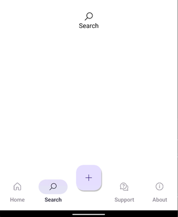
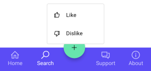

# TabBar & TabBarItem

> [!TIP] 
> This guide covers details for `TabBar` and `TabBarItem` specifically. If you are just getting started with the Uno Toolkit Material Library, please see our [general getting started](../getting-started.md) page to make sure you have the correct setup in place.

## Summary
Represents a control that provides a list of `TabItem`s to select from. The `TabBar` selection can be used to trigger frame navigation or to toggle the visibility of views.

## TabBarItem
`TabBarItem` is a specialized `SelectorItem` that includes functionality such as triggering an `ICommand` on click/tap or displaying a flyout.

### C#
```csharp
public partial class TabBarItem : SelectorItem
```

### XAML
```xml
xmlns:utu="using:Uno.Toolkit.UI"
...

<utu:TabBarItem Content="..." />
-or-
<utu:TabBarItem ...>
	content
</utu:TabBarItem>
```

### Inheritance 
Object &#8594; DependencyObject &#8594; UIElement &#8594; FrameworkElement &#8594; Control &#8594; ContentControl &#8594; SelectorItem &#8594; TabBarItem

### Constructors
| Constructor  | Description                                           |
|--------------|-------------------------------------------------------|
| TabBarItem() | Initializes a new instance of the `TabBarItem` class. |

### Properties
Property|Type|Description
-|-|-
BadgeValue|string|Gets or sets the value to be displayed in the badge of the `TabBarItem`. If a value is set the large badge will be displayed otherwise it will be the small badge. (Currently only usable with the Material Theme Toolkit Library with the `BottomTabBarItem` style)
BadgeVisibility|Visibility|Gets or sets the badge visibility of the `TabBarItem`. (Currently only usable with the Material Theme Toolkit Library with the `BottomTabBarItem` style)
Command|ICommand|Gets or sets the command to invoke when the `TabBarItem` is pressed.
CommandParameter|object|Gets or sets the parameter to pass to the `Command` property.
Flyout|double|Gets or sets the flyout associated with this `TabBarItem`.
Icon|IconElement|Gets or sets the icon of the `TabBarItem`.
IsSelectable|bool|Gets or sets whether the `TabBarItem` can be selected.

### Events
Event|Type|Description
-|-|-
Click|RoutedEventHandler|Occurs when the `TabBarItem` is pressed.

## TabBar
`TabBar` is a specialized `ItemsControl` used to present a collection of `TabBarItem`s.

### C#
```csharp
public partial class TabBar : ItemsControl
```

### XAML
```xml
xmlns:utu="using:Uno.Toolkit.UI"
...

<utu:TabBar .../>
-or-
<utu:TabBar ...>
	oneOrMoreItems
</utu:TabBar>
-or-
<utu:TabBar ...>
	<utu:TabBar.Items>
  		oneOrMoreItems
  	</utu:TabBar.Items>
</utu:TabBar>
```

### Inheritance 
Object &#8594; DependencyObject &#8594; UIElement &#8594; FrameworkElement &#8594; Control &#8594; ItemsControl &#8594; TabBar

### Constructors
| Constructor | Description                                       |
|-------------|---------------------------------------------------|
| TabBar()    | Initializes a new instance of the `TabBar` class. |

### Properties
Property|Type|Description
-|-|-
SelectedIndex|int|Gets or sets the index of the selected `TabBarItem`.
SelectedItem|object|Gets or sets the selected `TabBarItem`.

> Note: `TabBar` only supports a single selection mode.

### Events
All events below are forwarded from the nested `TabBarItem`s:
Event|Type|Description
-|-|-
SelectionChanged|`TypedEventHandler<TabBar, TabBarSelectionChangedEventArgs>`|Occurs when a `TabBarItem`'s selection state has changed.

```cs
class TabBarSelectionChangedEventArgs : EventArgs
{
    // Gets the newly selected TabBarItem
    object? NewItem { get; }

    // Gets the previously selected TabBarItem
    object? OldItem { get; }
}
```

## Styling `TabBar` & `TabBarItem`
Toolkit provides a barebones default style for `TabBar` and `TabBarItem`. It is recommended to use either:
* [One of the pre-built styles](../controls-styles.md#control-styles) that come packaged within the `Uno.Toolkit.UI.Material` or `Uno.Toolkit.UI.Cupertino` libraries
* A custom-built style that is defined within the consuming application

The styles that exist within the Toolkit Theming Libraries are built for the most common scenarios in which a `TabBar` could be used.

### "Top" `TabBar` Style

A common use for a `TabBar` would be to use it as a means of navigation between two or more views/pages that are all at the same level of hierarchy (Lateral Navigation). If the goal is to provide lateral navigation for destinations that are at **any** level of the hierarchy, a `TabBar` styled as a `TopTabBar` is most appropriate. 

Currently, the Material Theme Toolkit Library contains two styles for this purpose: `ColoredTopTabBarStyle` and `TopTabBarStyle`.

```xml
xmlns:utu="using:Uno.Toolkit.UI"
...

<utu:TabBar SelectedIndex="1"
			Style="{StaticResource ColoredTopTabBarStyle}">
	<utu:TabBar.Items>
		<utu:TabBarItem Content="Home" />
		<utu:TabBarItem Content="Search" />
		<utu:TabBarItem Content="Support" />
		<utu:TabBarItem Content="About" />
	</utu:TabBar.Items>
</utu:TabBar>
```


### "Bottom" `TabBar` Style

Following the explanation of Lateral Navigation and the use case for "Top" `TabBar` styles, another common scenario is to use `TabBar` as an application's primary navigation component. In this case, we want a component that would provide lateral navigation to all **top-level** destinations. In this case, a `TabBar` styled as a `BottomTabBar` is most appropriate.

Currently, both the Material and Cupertino Theme Toolkit Libraries contain a `BottomTabBarStyle`.

```xml
xmlns:utu="using:Uno.Toolkit.UI"
...

<utu:TabBar SelectedIndex="1"
		    Style="{StaticResource BottomTabBarStyle}">
	<utu:TabBarItem>
		<utu:TabBarItem.Icon>
			<SymbolIcon Symbol="Home" />
		</utu:TabBarItem.Icon>
	</utu:TabBarItem>
	<utu:TabBarItem>
		<utu:TabBarItem.Icon>
			<SymbolIcon Symbol="Find" />
		</utu:TabBarItem.Icon>
	</utu:TabBarItem>
	<utu:TabBarItem>
		<utu:TabBarItem.Icon>
			<SymbolIcon Symbol="Help" />
		</utu:TabBarItem.Icon>
	</utu:TabBarItem>
	<utu:TabBarItem>
		<utu:TabBarItem.Icon>
			<SymbolIcon Symbol="Flag" />
		</utu:TabBarItem.Icon>
	</utu:TabBarItem>
</utu:TabBar>
```

#### Material


#### Cupertino


### "Vertical" `TabBar` Style

Along with using the "Bottom" `TabBar`, Toolkit also provides a "Vertical" `TabBar` to use as an application's primary navigation component.  In this case, we want a component that would provide lateral navigation to all **top-level** destinations.

Currently, only the Material Theme Toolkit Library contains a `VerticalTabBarStyle`.

```xml
xmlns:utu="using:Uno.Toolkit.UI"
...

<utu:TabBar SelectedIndex="1"
		    Style="{StaticResource VerticalTabBarStyle}">
	<utu:TabBarItem>
		<utu:TabBarItem.Icon>
			<SymbolIcon Symbol="Home" />
		</utu:TabBarItem.Icon>
	</utu:TabBarItem>
	<utu:TabBarItem>
		<utu:TabBarItem.Icon>
			<SymbolIcon Symbol="Find" />
		</utu:TabBarItem.Icon>
	</utu:TabBarItem>
	<utu:TabBarItem>
		<utu:TabBarItem.Icon>
			<SymbolIcon Symbol="Help" />
		</utu:TabBarItem.Icon>
	</utu:TabBarItem>
	<utu:TabBarItem>
		<utu:TabBarItem.Icon>
			<SymbolIcon Symbol="Flag" />
		</utu:TabBarItem.Icon>
	</utu:TabBarItem>
</utu:TabBar>
```

#### Material


There are some styles that are built specifically for the Cupertino theme. These styles are used to emulate a [`UISegmentedControl`](https://developer.apple.com/documentation/uikit/uisegmentedcontrol)

```xml
xmlns:utu="using:Uno.Toolkit.UI"
...

<utu:TabBar Style="{StaticResource SegmentedStyle}">
	<utu:TabBar.Items>
		<utu:TabBarItem Content="ORANGE" />
		<utu:TabBarItem Content="PURPLE" />
		<utu:TabBarItem Content="BLUE" />
	</utu:TabBar.Items>
</utu:TabBar>

<utu:TabBar Style="{StaticResource SlidingSegmentedStyle}">
	<utu:TabBar.Items>
		<utu:TabBarItem Content="ORANGE" />
		<utu:TabBarItem Content="PURPLE" />
		<utu:TabBarItem Content="BLUE" />
	</utu:TabBar.Items>
</utu:TabBar>
```


### `TabBarItem` Style
The Uno Toolkit provides several styles of `TabBarItem` for both Material and Cupertino themes.

Style Key|Material|Cupertino
-|-|-
BottomFabTabBarItemStyle|&check;|
BottomTabBarItemStyle|&check;|&check;|
ColoredTopTabBarItemStyle|&check;|
SegmentedItemStyle||&check;|
SlidingSegmentedItemStyle|&check;|
TopTabBarItemStyle|&check;|

These pre-built styles can be used for more complex `TabBar` scenarios. For example, using the BottomFabTabBarItemStyle, we can embed Floating Action Buttons into the `TabBar`.

```xml
xmlns:utu="using:Uno.Toolkit.UI"
...

<utu:TabBar SelectedIndex="1"
		    Style="{StaticResource BottomTabBarStyle}">
	<utu:TabBar.Items>
		<utu:TabBarItem Content="Home">
			<utu:TabBarItem.Icon>
				<FontIcon Glyph="&#xE80F;" />
			</utu:TabBarItem.Icon>
		</utu:TabBarItem>
		<utu:TabBarItem Content="Search">
			<utu:TabBarItem.Icon>
				<FontIcon Glyph="&#xe721;" />
			</utu:TabBarItem.Icon>
		</utu:TabBarItem>
		<utu:TabBarItem Style="{StaticResource BottomFabTabBarItemStyle}">
			<utu:TabBarItem.Flyout>
				<MenuFlyout MenuFlyoutPresenterStyle="{StaticResource MenuFlyoutPresenterStyle}"
						    Placement="Top">

					<MenuFlyoutItem Style="{StaticResource MenuFlyoutItemStyle}"
							        Text="Like">
						<MenuFlyoutItem.Icon>
							<SymbolIcon Symbol="Like" />
						</MenuFlyoutItem.Icon>
					</MenuFlyoutItem>

					<MenuFlyoutItem Style="{StaticResource MenuFlyoutItemStyle}"
							        Text="Dislike">
						<MenuFlyoutItem.Icon>
							<SymbolIcon Symbol="Dislike" />
						</MenuFlyoutItem.Icon>
					</MenuFlyoutItem>
				</MenuFlyout>
			</utu:TabBarItem.Flyout>
			<utu:TabBarItem.Icon>
				<SymbolIcon Symbol="Add" />
			</utu:TabBarItem.Icon>
		</utu:TabBarItem>
		<utu:TabBarItem Content="Support">
			<utu:TabBarItem.Icon>
				<FontIcon Glyph="&#xE8F2;" />
			</utu:TabBarItem.Icon>
		</utu:TabBarItem>
		<utu:TabBarItem Content="About">
			<utu:TabBarItem.Icon>
				<FontIcon Glyph="&#xE946;" />
			</utu:TabBarItem.Icon>
		</utu:TabBarItem>
	</utu:TabBar.Items>
</utu:TabBar>
```




#### Badge usage for the Material `BottomTabBarItem` Style
Icons in `TabBar` items can display badges in their upper right corners. 

Badges can contain dynamic information, such as the number of new messages.

Currently, only the Material Theme Toolkit Library contains a `BottomTabBarItemStyle` that you can use to display a badge (which is optional).


##### Small Badge
A small badge uses only shape to indicate a status change or new notification.


```xml
xmlns:utu="using:Uno.Toolkit.UI"
...

<utu:TabBarItem Content="Favorites"
				BadgeVisibility="Visible"
				Style="{StaticResource BottomTabBarItemStyle}">
	<utu:TabBarItem.Icon>
		<FontIcon Glyph="&#xE113;" />
	</utu:TabBarItem.Icon>
</utu:TabBarItem>
```

##### Large Badge
A large badge displays a number within a container to indicate a quantifiable status change related to a destination.


```xml
xmlns:utu="using:Uno.Toolkit.UI"
...

<utu:TabBarItem Content="Mail"
				BadgeValue="8"
				BadgeVisibility="Visible"
				Style="{StaticResource BottomTabBarItemStyle}">
	<utu:TabBarItem.Icon>
		<FontIcon Glyph="&#xE119;" />
	</utu:TabBarItem.Icon>
</utu:TabBarItem>
```