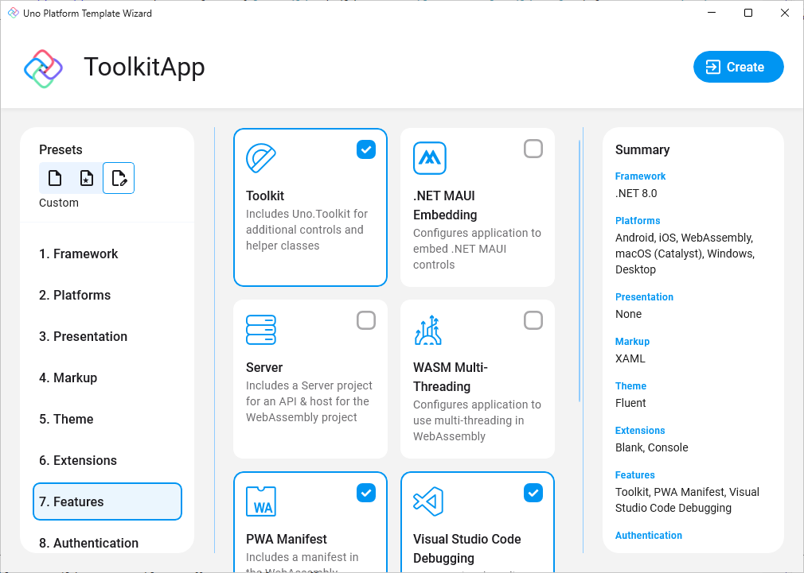

# Getting Started with Uno Toolkit

## Uno Toolkit Library

The Uno Toolkit library is available as NuGet packages that can be added to any new or existing Uno solution.

This article is a guide for installing the base Uno Toolkit library, additional steps are needed when installing the Toolkit support libraries for Uno Material and Uno Cupertino. Most controls within the base Uno Toolkit library are not designed to be used without an underlying design system installed. Refer to the following guides for Material/Cupertino support:

- [Getting Started with Material for Toolkit](xref:Toolkit.GettingStarted.Material)
- [Getting Started with Cupertino for Toolkit](xref:Toolkit.GettingStarted.Cupertino)

> [!Video https://www.youtube-nocookie.com/embed/sDmyWJaQp4Q]

### Installation

### Creating a new project with Uno Toolkit

#### [**Wizard**](#tab/wizard)

1. Follow the steps in the [Getting Started with Visual Studio](xref:Uno.GettingStarted.CreateAnApp.VS2022#create-the-app) instructions to launch the Uno Platform Template Wizard.
2. Select `Toolkit` under the `Features` section.

    

#### [**CLI**](#tab/cli)

1. Install the [`dotnet new` CLI templates](xref:Uno.GetStarted.dotnet-new) with:

    ```bash
    dotnet new install Uno.Templates
    ```

2. Create a new application with:

    ```bash
    dotnet new unoapp -o ToolkitApp -toolkit
    ```

---

### Installing Uno Toolkit in an existing project

Depending on the type of project template that the Uno Platform application was created with, follow the instructions below to install Uno Toolkit.

#### [**Single Project Template**](#tab/singleproj)

1. Edit your project file (`PROJECT_NAME.csproj`) and add `Toolkit` to the list of `UnoFeatures`:

    ```xml
    <UnoFeatures>Toolkit</UnoFeatures>
    ```

2. Initialize `ToolkitResources` in the `App.xaml`:

    ```xml
    <Application.Resources>
        <ResourceDictionary>
            <ResourceDictionary.MergedDictionaries>

                <!-- Code omitted of brevity -->

                <ToolkitResources xmlns="using:Uno.Toolkit.UI" />
            </ResourceDictionary.MergedDictionaries>
        </ResourceDictionary>
    </Application.Resources>
    ```

#### [**Multi-Head Project Template (Legacy)**](#tab/multihead)

1. In the Solution Explorer panel, right-click on your app's **App Code Library** project (`PROJECT_NAME.csproj`) and select `Manage NuGet Packages...`
2. Install the [`Uno.Toolkit.WinUI`](https://www.nuget.org/packages/Uno.Toolkit.WinUI)
3. Add the `ToolkitResources` to `AppResources.xaml`:

    ```xml
    <ResourceDictionary>
        <ResourceDictionary.MergedDictionaries>

            <ToolkitResources xmlns="using:Uno.Toolkit.UI" />

        </ResourceDictionary.MergedDictionaries>
    </ResourceDictionary>
    ```

#### [**Shared Project (.shproj) Template (Legacy)**](#tab/shproj)

1. In the Solution Explorer panel, right-click on your solution name and select `Manage NuGet Packages for Solution ...`. Choose either:
     - The [`Uno.Toolkit.UI`](https://www.nuget.org/packages/Uno.Toolkit.UI/) package when targetting Xamarin/UWP
     - The [`Uno.Toolkit.WinUI`](https://www.nuget.org/packages/Uno.Toolkit.WinUI) package when targetting net6.0+/WinUI

2. Select the following projects for installation:
    - `PROJECT_NAME.Wasm.csproj`
    - `PROJECT_NAME.Mobile.csproj` (or `PROJECT_NAME.iOS.csproj`, `PROJECT_NAME.Droid.csproj`, and `PROJECT_NAME.macOS.csproj` if you have an existing project)
    - `PROJECT_NAME.Skia.Gtk.csproj`
    - `PROJECT_NAME.Skia.WPF.csproj`
    - `PROJECT_NAME.Windows.csproj` (or `PROJECT_NAME.UWP.csproj` for existing projects)
3. Add the following resources inside `App.xaml`:

    ```xml
    <Application ...>
        <Application.Resources>
            <ResourceDictionary>
                <ResourceDictionary.MergedDictionaries>

                    <!-- Load WinUI resources -->
                    <XamlControlsResources xmlns="using:Microsoft.UI.Xaml.Controls" />

                    <ToolkitResources xmlns="using:Uno.Toolkit.UI" />

                    <!-- Load custom application resources -->
                    <!-- ... -->

                </ResourceDictionary.MergedDictionaries>
            </ResourceDictionary>
        </Application.Resources>
    </Application>
    ```

---

> [!NOTE]
> If you are using the [Uno.Toolkit.WinUI.Material](https://www.nuget.org/packages/Uno.Toolkit.WinUI.Material) or [Uno.Toolkit.WinUI.Cupertino](https://www.nuget.org/packages/Uno.Toolkit.WinUI.Cupertino) NuGet packages, follow the steps in the [Getting Started with Material for Toolkit](xref:Toolkit.GettingStarted.Material) or [Getting Started with Cupertino for Toolkit](xref:Toolkit.GettingStarted.Cupertino) guides instead as they already include the base Uno Toolkit library.

## Using C# Markup

The Uno Toolkit library also has support for C# Markup through a [Uno.Toolkit.WinUI.Markup](https://www.nuget.org/packages/Uno.Toolkit.WinUI.Markup) NuGet Package.

To get started with Uno Toolkit in your C# Markup application, add the `Uno.Toolkit.WinUI.Markup` NuGet package to your application project and add the following code to your `App.cs`:

```csharp
using Uno.Toolkit.UI.Markup;

this.Build(r => r.UseToolkit());
```

> [!NOTE]
> If you are using the [Uno.Toolkit.WinUI.Material.Markup](https://www.nuget.org/packages/Uno.Toolkit.WinUI.Material.Markup) NuGet package, follow the steps in the [Using C# Markup for the Material Toolkit](xref:Toolkit.GettingStarted.Material#using-c-markup) guide instead as it includes the base Uno Toolkit Markup library.
