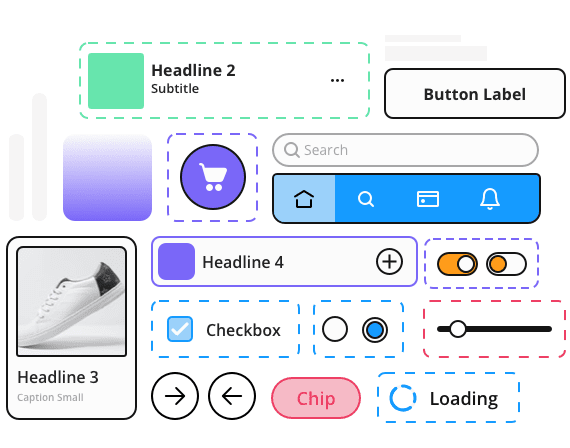

# Getting Started with Uno Toolkit

<p align="center">
  
</p>

Uno Toolkit provides a set of higher-level UI controls designed specifically for multi-platform, responsive applications. Uno Toolkit works seamlessly with UI components from WinUI and Windows Community
Toolkit, providing you hundreds of UI components for fast development.

1. Open an existing Uno project, or create a new Uno project using the `Multi-Platform App (Uno Platform)` template.
2. In the Solution Explorer panel, right-click on your solution name and select `Manage NuGet Packages for Solution ...`.
Select either the [**`Uno.Toolkit.UI`**](https://www.nuget.org/packages/Uno.Toolkit.UI) package for Uno projects that are targetting the Xamarin/UWP APIs **or** [**`Uno.Toolkit.WinUI`**](https://www.nuget.org/packages/Uno.Toolkit.WinUI) when targetting the  net6.0-mobile/WinUI 3 APIs. Select the following projects to install the Toolkit NuGet package:
    - `PROJECT_NAME.Wasm.csproj`
    - `PROJECT_NAME.Mobile.csproj` (or `PROJECT_NAME.iOS.csproj`, `PROJECT_NAME.Droid.csproj`, `PROJECT_NAME.macOS.csproj` if you are targetting Xamarin/UWP)
    - `PROJECT_NAME.Skia.Gtk.csproj`
    - `PROJECT_NAME.Skia.WPF.csproj`
    - `PROJECT_NAME.Windows.csproj` (or `PROJECT_NAME.UWP.csproj` for UWP projects)
3. Initialize the `ToolkitResources` in your `App.xaml`:

    ```xml
    <Application ...>
        <Application.Resources>
            <ResourceDictionary>
                <ResourceDictionary.MergedDictionaries>

                    <!-- Load WinUI resources -->
                    <XamlControlsResources xmlns="using:Microsoft.UI.Xaml.Controls" />

                    <!-- Load Uno.Toolkit.UI resources -->
                    <ToolkitResources xmlns="using:Uno.Toolkit.UI" />

                    <!-- Load custom application resources -->
                    <!-- ... -->

                </ResourceDictionary.MergedDictionaries>
            </ResourceDictionary>
        </Application.Resources>
    </Application>
    ```

> **NOTE**: Uno Toolkit also provides Material Design styles for all of its components. These optional styles are packaged in a separate NuGet package. Refer to the [Uno Toolkit Material Library](material/getting-started-material.md) guide for more information.
