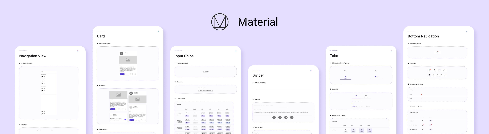

# Getting Started with Uno Toolkit

## Uno Toolkit Material Library
<p align="center">
  
</p>

The Uno.Toolkit.Material library is available as NuGet packages that can be added to any new or existing Uno solution.

1. Open an existing Uno project, or create a new Uno project using the `Multi-Platform App (Uno Platform)` template.
2. In the Solution Explorer panel, right-click on your solution name and select `Manage NuGet Packages for Solution ...`.
Choose [`Uno.Toolkit.UI.Material`](https://www.nuget.org/packages/Uno.Toolkit.UI.Material) package for Uno UWP solution or Choose the [`Uno.Toolkit.WinUI.Material`](https://www.nuget.org/packages/Uno.Toolkit.WinUI.Material) package for Uno WinUI solution. And, select the following projects to include:
	- `PROJECT_NAME.Wasm.csproj`
	- `PROJECT_NAME.Mobile.csproj` (or `PROJECT_NAME.iOS.csproj`, `PROJECT_NAME.Droid.csproj`, `PROJECT_NAME.macOS.csproj` if you have an existing project)
	- `PROJECT_NAME.Skia.Gtk.csproj`
	- `PROJECT_NAME.Skia.WPF.csproj`
	- `PROJECT_NAME.Windows.csproj` (or `PROJECT_NAME.UWP.csproj` for existing projects)
3. Add the resources to `App.xaml`:
	```xml
	<Application ...>
		<Application.Resources>
			<ResourceDictionary>
				<ResourceDictionary.MergedDictionaries>

					<!-- Load WinUI resources -->
					<XamlControlsResources xmlns="using:Microsoft.UI.Xaml.Controls" />

					<!-- Load Uno.Material resources -->
					<MaterialColors xmlns="using:Uno.Material" />
					<MaterialFonts xmlns="using:Uno.Material" />
					<MaterialResources xmlns="using:Uno.Material" />

					<!-- Load Uno.Toolkit.UI resources -->
					<ToolkitResources xmlns="using:Uno.Toolkit.UI" />
					<MaterialToolkitResources xmlns="using:Uno.Toolkit.UI.Material" />

					<!-- Load custom application resources -->
					<!-- ... -->

				</ResourceDictionary.MergedDictionaries>
			</ResourceDictionary>
		</Application.Resources>
	</Application>
	```
	> [!TIP]
	> The styles for the new controls are found in both ToolkitResources (design-agnostic variants) and MaterialToolkitResources (Material Design variants).

## Customization
For instruction on changing the default color palette or the font family, please refer to [this guide](https://github.com/unoplatform/Uno.Themes/blob/master/doc/getting-started.md#customization).
