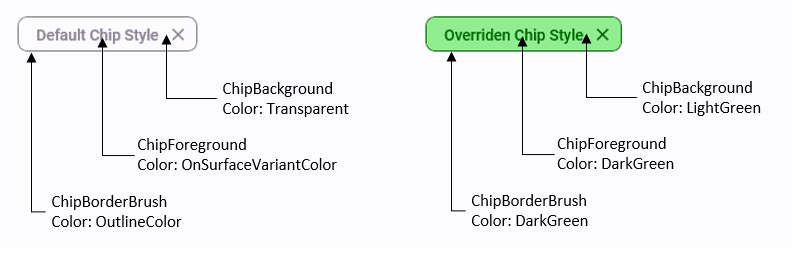
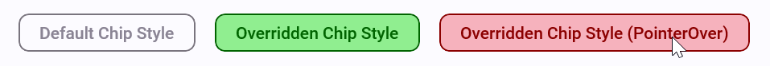

# Lightweight Styling

For general information about [lightweight styling](https://learn.microsoft.com/windows/apps/design/style/xaml-styles#lightweight-styling), check out [Lightweight Styling in Uno.Themes](xref:uno.themes.lightweightstyling).

## Example

```xml
<utu:Chip Content="Default Chip Style" Style="{StaticResource FilterChipStyle}" />

<utu:Chip Content="Overriden Chip Style" Style="{StaticResource FilterChipStyle}">
	<utu:Chip.Resources>
		<SolidColorBrush x:Key="ChipForeground" Color="DarkGreen" />
		<SolidColorBrush x:Key="ChipBackground" Color="LightGreen" />
		<SolidColorBrush x:Key="ChipBorderBrush" Color="DarkGreen" />
	</utu:Chip.Resources>
</utu:Chip>
```



Just like in [Uno.Themes](xref:uno.themes.lightweightstyling), some interactive controls have multiple states (eg. ChipForeground*PointerOver*, ChipForeground*Pressed*, ChipForeground*Disabled*). Combined with these, the Chip control also has a **Checked** state. [These links](lightweight-styling#resource-keys) list the resource keys for each control.

```xml
<utu:Chip Content="Overriden Chip Style" Style="{StaticResource FilterChipStyle}">
	<utu:Chip.Resources>
		<SolidColorBrush x:Key="ChipForeground" Color="DarkGreen" />
		<SolidColorBrush x:Key="ChipBackground" Color="LightGreen" />
		<SolidColorBrush x:Key="ChipBorderBrush" Color="DarkGreen" />

		<!-- Overriding the PointerOver brushes -->
		<SolidColorBrush x:Key="ChipForegroundPointerOver" Color="DarkRed" />
		<SolidColorBrush x:Key="ChipBackgroundPointerOver" Color="LightPink" />
		<SolidColorBrush x:Key="ChipBorderBrushPointerOver" Color="DarkRed" />
	</utu:Chip.Resources>
</utu:Chip>
```



## Resource Keys

For more information about the lightweight styling resource keys used in each control, check out the following links:

- [Card](controls/CardAndCardContentControl.md#lightweight-styling)
- [CardContentControl](controls/CardAndCardContentControl.md#lightweight-styling-1)
- [Chip](controls/ChipAndChipGroup.md#lightweight-styling)
- [NavigationBar](controls/NavigationBar.md#lightweight-styling)
- [TabBar](controls/TabBarAndTabBarItem.md#lightweight-styling)

### Further Reading

https://learn.microsoft.com/windows/apps/design/style/xaml-styles#lightweight-styling