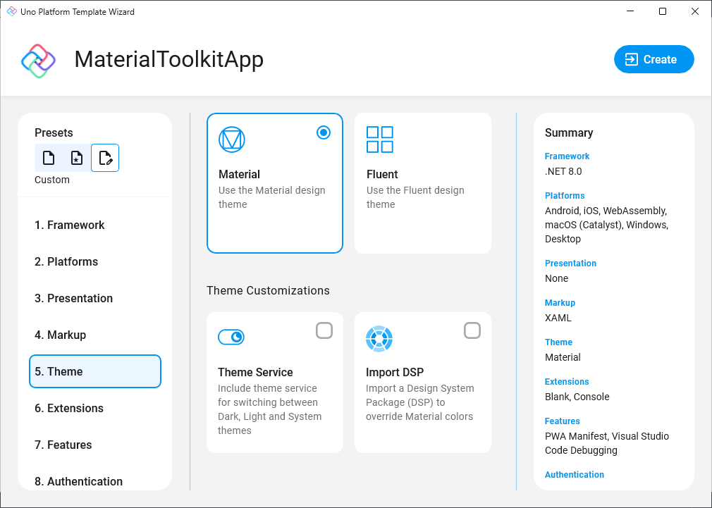
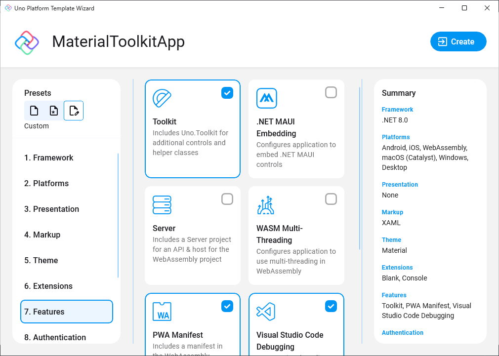

# Uno Material Toolkit Library

<p align="center">
  
</p>

The Uno Material Toolkit provides a set of resources and styles based on [Material Design guidelines](https://m3.material.io/) for the controls included in the base [Uno Toolkit library](xref:Toolkit.GettingStarted)

## Getting Started

Initialization of the Material Toolkit resources is handled by the specialized `MaterialToolkitTheme` ResourceDictionary.

### `MaterialToolkitTheme`

> [!NOTE]
> The `MaterialToolkitTheme` class also handles the required initialization of the Uno Material resources. Therefore, there is no need to initialize `MaterialTheme` within the `App.xaml`

#### Constructors

| Constructor                                                                                 | Description                                                                                                  |
|---------------------------------------------------------------------------------------------|--------------------------------------------------------------------------------------------------------------|
| `MaterialToolkitTheme()`                                                                    | Initializes a new instance of the `MaterialToolkitTheme` resource dictionary.                                |
| `MaterialToolkitTheme(ResourceDictionary? colorOverride, ResourceDictionary? fontOverride)` | Initializes a new instance of the `MaterialToolkitTheme` resource dictionary and applies the given overrides |

#### Properties

| Property              | Type     | Description                                                                                                                                                                            |
|-----------------------|----------|----------------------------------------------------------------------------------------------------------------------------------------------------------------------------------------|
| `ColorOverrideSource` | `string` | (Optional) Gets or sets a Uniform Resource Identifier that provides the source location of a ResourceDictionary containing overrides for the default Uno.Material Color resources      |
| `FontOverrideSource`  | `string` | (Optional) Gets or sets a Uniform Resource Identifier that provides the source location of a ResourceDictionary containing overrides for the default Uno.Material FontFamily resources |

## Installation

> [!NOTE]
> Make sure to setup your environment first by [following our instructions](xref:Uno.GetStarted.vs2022).

### Creating a new project with the Uno Material Toolkit

#### [**Wizard**](#tab/wizard)

1. Follow the steps in the [Getting Started with Visual Studio](xref:Uno.GettingStarted.CreateAnApp.VS2022#create-the-app) instructions to launch the Uno Platform Template Wizard.
2. Select `Material` under the `Theme` section.

    

3. Select `Toolkit` under the `Features` section.

    

#### [**CLI**](#tab/cli)

1. Install the [`dotnet new` CLI templates](xref:Uno.GetStarted.dotnet-new) with:

    ```bash
    dotnet new install Uno.Templates
    ```

2. Create a new application with:

    ```bash
    dotnet new unoapp -o MaterialToolkitApp -toolkit -theme material
    ```

---

### Installing Uno Material Toolkit in an existing project

Depending on the type of project template that the Uno Platform application was created with, follow the instructions below to install the Uno Material Toolkit.

#### [**Single Project Template**](#tab/singleproj)

1. Edit your project file (`PROJECT_NAME.csproj`) and add `Toolkit` and `Material` to the list of `UnoFeatures`:

    ```xml
    <UnoFeatures>Toolkit;Material</UnoFeatures>
    ```

2. Initialize `MaterialToolkitTheme` in the `App.xaml`:

    ```xml
    <Application.Resources>
        <ResourceDictionary>
            <ResourceDictionary.MergedDictionaries>

                <!-- Code omitted of brevity -->

                <MaterialToolkitTheme xmlns="using:Uno.Toolkit.UI.Material" />
            </ResourceDictionary.MergedDictionaries>
        </ResourceDictionary>
    </Application.Resources>
    ```

#### [**Multi-Head Project Template (Legacy)**](#tab/multihead)

1. In the Solution Explorer panel, right-click on your app's **App Code Library** project (`PROJECT_NAME.csproj`) and select `Manage NuGet Packages...`
2. Install the [`Uno.Toolkit.WinUI.Material`](https://www.nuget.org/packages/Uno.Toolkit.WinUI.Material)
3. Add the `MaterialToolkitTheme` to `AppResources.xaml`:

    ```xml
    <ResourceDictionary>
        <ResourceDictionary.MergedDictionaries>

            <MaterialToolkitTheme xmlns="using:Uno.Toolkit.UI.Material" />

        </ResourceDictionary.MergedDictionaries>
    </ResourceDictionary>
    ```

#### [**Shared Project (.shproj) Template (Legacy)**](#tab/shproj)

1. In the Solution Explorer panel, right-click on your solution name and select `Manage NuGet Packages for Solution ...`. Choose either:
     - The [`Uno.Toolkit.UI.Material`](https://www.nuget.org/packages/Uno.Toolkit.UI.Material/) package when targetting Xamarin/UWP
     - The [`Uno.Toolkit.WinUI.Material`](https://www.nuget.org/packages/Uno.Toolkit.WinUI.Material) package when targetting net6.0+/WinUI

2. Select the following projects for installation:
    - `PROJECT_NAME.Wasm.csproj`
    - `PROJECT_NAME.Mobile.csproj` (or `PROJECT_NAME.iOS.csproj`, `PROJECT_NAME.Droid.csproj`, and `PROJECT_NAME.macOS.csproj` if you have an existing project)
    - `PROJECT_NAME.Skia.Gtk.csproj`
    - `PROJECT_NAME.Skia.WPF.csproj`
    - `PROJECT_NAME.Windows.csproj` (or `PROJECT_NAME.UWP.csproj` for existing projects)
3. Add the following resources inside `App.xaml`:

    ```xml
    <Application ...>
        <Application.Resources>
            <ResourceDictionary>
                <ResourceDictionary.MergedDictionaries>

                    <!-- Load WinUI resources -->
                    <XamlControlsResources xmlns="using:Microsoft.UI.Xaml.Controls" />

                    <MaterialToolkitTheme xmlns="using:Uno.Toolkit.UI.Material" />

                    <!-- Load custom application resources -->
                    <!-- ... -->

                </ResourceDictionary.MergedDictionaries>
            </ResourceDictionary>
        </Application.Resources>
    </Application>
    ```

---

## Customization

With `MaterialToolkitTheme`, you do not need to explicitly initialize `ToolkitResources`, `MaterialTheme`, `MaterialColors`, or `MaterialFonts`. This means that all resource overrides should go through `MaterialToolkitTheme` itself. There are two properties on `MaterialToolkitTheme` that you can set within your `App.xaml`.

### Customize Colors

Follow the [Uno Material Customization guide](xref:Uno.Themes.Material.GetStarted#customization) to create a `ColorPaletteOverride.xaml` file and add it to your application project.

In `App.xaml`, use the `ColorOverrideSource` property on `MaterialToolkitTheme`:

```xml
<MaterialToolkitTheme xmlns="using:Uno.Toolkit.UI.Material"
                      ColorOverrideSource="ms-appx:///Style/Application/ColorPaletteOverride.xaml" />
```

### Customize Fonts

Follow the [Uno Material Customization guide](xref:Uno.Themes.Material.GetStarted#customization) to create a `FontOverride.xaml` file and add it to your application project.

In `App.xaml`, use the `FontOverrideSource` property on `MaterialToolkitTheme`:

```xml
<MaterialToolkitTheme xmlns="using:Uno.Toolkit.UI.Material"
                      FontOverrideSource="ms-appx:///Style/Application/FontOverride.xaml" />
```

## Using C# Markup

The Uno Material Toolkit library also has support for C# Markup through a [Uno.Toolkit.WinUI.Material.Markup](https://www.nuget.org/packages/Uno.Toolkit.WinUI.Material.Markup) NuGet Package.

To get started with the Uno Material Toolkit in your C# Markup application, add the `Uno.Toolkit.WinUI.Material.Markup` NuGet package to your application project.
Then, add the following code to your `App.xaml.cs`:

```csharp
using Uno.Toolkit.UI.Material.Markup;

this.Build(r => r.UseMaterialToolkit(
    //optional
    new Styles.ColorPaletteOverride(),
    //optional
    new Styles.MaterialFontsOverride()
));
```

> [!NOTE]
> The [Uno.Toolkit.WinUI.Material.Markup](https://www.nuget.org/packages/Uno.Toolkit.WinUI.Material.Markup) NuGet package includes the base [Uno Toolkit Markup package](https://www.nuget.org/packages/Uno.Toolkit.WinUI.Markup) as a dependency. Therefore, there is no need to add the `Uno.Toolkit.WinUI.Markup` package separately. Furthermore, the `UseMaterialToolkit` extension method also initializes the base Uno Toolkit library, so there is no need to call the `UseToolkit` extension method in your `App.xaml.cs`.

## Additional Resources

- [Uno Platform Material Toolkit Sample App](https://aka.platform.uno/unomaterialtoolkit-sampleapp)
- [Uno Platform Material Toolkit Figma File](https://aka.platform.uno/uno-figma-material-toolkit)
- [Official Material Design 3 Guidelines](https://m3.material.io/components)
- [Official Material Design 3 Theme Builder](https://m3.material.io/theme-builder)
